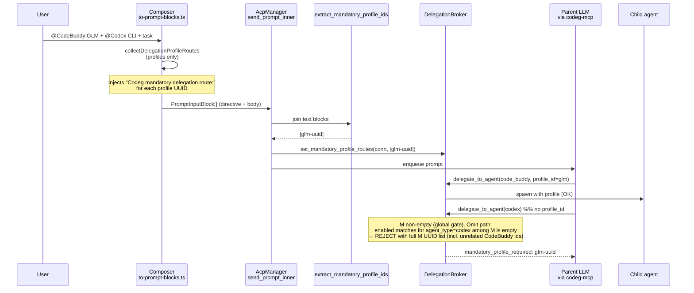
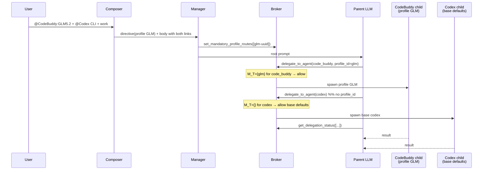

# Scope-Narrow Mandatory Delegation Routes (Profiles vs Base Agents)

| Field | Value |
| --- | --- |
| **Status** | Ready for implementation (post code-backed design review) |
| **Author** | TBD |
| **Date** | 2026-07-14 |
| **Product** | Codeg (multi-agent coding workbench) |
| **Primary area** | `src-tauri/src/acp/delegation/` + composer send path |
| **Preferred option** | Option A (agent_type-scoped mandatory enforcement) |
| **Option B** | Follow-up design + PR (out of scope for the core fix) |
| **Edit target (PR1)** | `DelegationBroker::start_delegation` mandatory block (not `handle_request`) |
| **Last review** | 2026-07-14 — Codex CLI unavailable (403 official-clients only); full review against repo + design fixes applied |

---

## Overview

When a user @-mentions both **delegation profiles** (`codeg://delegation-profile/...`) and **base agents** (`codeg://agent/codex`, `codeg://agent/grok`) in one prompt, Codeg today installs a **global** mandatory profile set on the parent connection for the turn. The broker then **fail-closes every** `delegate_to_agent` call while that set is non-empty: omitted `profile_id` only auto-fills when a unique mandatory profile matches the requested `agent_type`; otherwise the call is rejected with `mandatory_profile_required` listing **all** mentioned profile UUIDs.

That correctly prevents profile substitution (e.g. calling base CodeBuddy defaults when the user named `@CodeBuddy:GLM5.2`), but it **over-scopes** anti-substitution: a legitimate `delegate_to_agent(agent_type=codex|grok)` without `profile_id` fails even though the user explicitly mentioned those base agents. Parent LLMs then see unrelated CodeBuddy UUIDs and either stall or mis-route.

This design scopes mandatory enforcement by **`agent_type`** (Option A): enforce exact profile routing only for agent types that appear among the mandatory profiles for the turn; allow base-agent defaults (and normal optional-profile behavior) for other agent types. Profile precision / anti-substitution is preserved for agent types that have mandatory profiles. Treating base-agent mentions as first-class mandatory routes (Option B) is a **follow-up that requires its own design**, not required to fix the production bug.

---

## Background & Motivation

### Current pipeline



### Key code today

Prefer **symbol names** over line ranges (lines drift). Approximate locations noted only as navigation aids.

| Layer | Location | Behavior |
| --- | --- | --- |
| Composer | `src/components/chat/composer/to-prompt-blocks.ts` — `collectDelegationProfileRoutes`, `docToPromptBlocks` | Walks only `refType === "delegation_profile"`. Emits one directive line per distinct profile with `agent_type`, `profile_id`, `profile_label`. **Base `agent` refs are not directives.** |
| Agent refs | `src/components/chat/composer/suggestion/adapters.ts` — `agentToSuggestion` | Sets `codeg://agent/<type>` as a **display/routing anchor**; comment explicitly defers "resolving it to real routing" as a future concern. |
| Extract | `src-tauri/src/acp/delegation/types.rs` — `extract_mandatory_profile_ids` | Collects UUIDs from column-0 directive lines (`profile_id="…"`) and closed markdown links `](codeg://delegation-profile/…)` outside code fences. Returns `Vec<String>` of UUIDs only. Typed URI path uses last path segment as UUID. |
| Install | `src-tauri/src/acp/manager.rs` — `send_prompt_inner` | Root user prompts only (`register_mandatory_routes: true`): after turn admission (`turn_in_flight = true`), sync call `set_mandatory_profile_routes(conn_id, ids)` before enqueue. Child prompts skip. Empty extract → empty set → **map entry removed** (clears prior turn). |
| Store | `DelegationBroker.mandatory_profile_routes` | `HashMap<parent_connection_id, BTreeSet<profile_uuid>>` behind `std::sync::Mutex` (sync install between `turn_in_flight` and enqueue). Keyed by **parent connection id** only — child connections never inherit parent `M`. |
| Enforce (**edit target**) | `broker.rs` — **`DelegationBroker::start_delegation`** after depth pre-check, before preferred profile/config resolution / spawn | If set **non-empty**: explicit `profile_id` must be in **global** set; omitted → auto-fill only if **exactly one** enabled profile in set matches `req.agent_type`; else `MandatoryProfileRequired`. **Asymmetry:** auto-fill already type-filters; membership and reject listing use full `M`. |
| Production MCP path | `listener.rs` → `broker.start_delegation(...)` | Does **not** go through `handle_request`. |
| Test-only waiter | `#[cfg(any(test, feature = "test-utils"))] handle_request` | Thin wrapper: `start_delegation` then long-poll until terminal. Existing mandatory tests call **`start_delegation`** for error_code; auto-fill tests may use `handle_request` + `MockSpawner` spawn_args. **PR1 must edit `start_delegation` body**, not only the test shim. |
| Post-mandatory validation | same `start_delegation` function, after mandatory gate | `InvalidDelegationProfile` / `DelegationProfileDisabled` / `DelegationProfileAgentMismatch` for explicit `profile_id` that passed membership (or unconstrained path). |
| Clear | `cancel_by_parent` / `cancel_by_parent_turn` | Clears routes so a late MCP call cannot ride the previous prompt’s set after cancel. **Not** cleared on successful `TurnComplete` / normal end_turn (see lifecycle below). |
| Wire error | `DelegationError::MandatoryProfileRequired` → code `mandatory_profile_required` | Variant: `#[error("mandatory profile_id required: {0}")]`. Wire uses `err.to_string()` (`DelegationOutcome::from_err` → `report_err`). Detail `{0}` is **not** a full standalone sentence today: omit path stores UUID list only; wrong-id stores continuation `profile_id {id} is not among mandatory routes: {list}`. Frontend does **not** parse this string (no `src/` consumers of the code) — safe to improve detail text. |

### Mandatory route lifecycle (full)

```text
[root prompt admitted]
  → set_mandatory_profile_routes(conn, ids)   // empty ids removes entry
  → live for this parent_connection_id while set remains
  → next root prompt on same connection: set again (overwrite)
       - profiles mentioned → new M
       - no profiles → empty extract → map entry removed (clears prior M)
  → cancel_by_parent / cancel_by_parent_turn: clear_mandatory_profile_routes
  → connection teardown that cancels parent: clear via cancel path

Successful end_turn / TurnComplete does NOT clear routes (existing behavior).
A late MCP call after a completed turn but before the next root prompt still
sees the previous turn's M. Accept for this design; do not change clear-on-success
in Option A PRs (separate change if product wants it).

Child prompts (register_mandatory_routes=false) never install routes.
Child agent connections have distinct parent_connection_id values, so a child
that itself calls delegate_to_agent is gated only by ITS own root prompt's M
(if any), never the grandparent's M.
```

### Pain points (validated)

1. **False rejects on base agents.** User: `@CodeBuddy:GLM5.2` + `@Codex CLI`. Parent correctly fans out GLM, then calls `delegate_to_agent(agent_type=codex)` without `profile_id` → **fail-closed** because mandatory set is non-empty and no codex profile is in the set.
2. **Confusing errors.** Rejection lists CodeBuddy profile UUIDs even when the request was for `codex`/`grok`, teaching the parent LLM the wrong recovery action (retry with a CodeBuddy UUID).
3. **Intent asymmetry.** Profiles are hard routes (composer directive + broker gate). Base agents are soft display anchors only. The gate currently treats “any profile mentioned” as “all delegations this turn must be profile-bound.”

### Intent that must remain true

- Mentioned profiles must be usable as **exact** routes (once each, fan-out before collect).
- Must not substitute another profile or silent base defaults **for agent types that have mandatory profiles**.
- Anti-substitution across mandatory profile UUIDs stays hard-enforced **within agent_type**.

### Intent that is broken

- Base-agent mentions should not be blocked by unrelated profile gates.
- Global fail-closed while *any* mandatory profile exists over-scopes anti-substitution.

---

## Goals & Non-Goals

### Goals

1. **Agent_type-scoped mandatory enforcement (Option A):** if `req.agent_type` has one or more mandatory profiles for the turn, enforce profile membership / unique auto-fill; otherwise allow base defaults (and normal optional `profile_id` validation).
2. **Preserve profile precision:** wrong or substitute profile_ids for a gated agent_type still fail closed.
3. **Clearer errors:** detail strings and UUID lists are scoped to the requested `agent_type` (and state the agent_type in **MCP/serde wire form**); do not dump unrelated profile UUIDs. Details must respect the existing `#[error("mandatory profile_id required: {0}")]` Display wrapper (detail-only payloads).
4. **Tests:** extend broker unit tests for mixed profile + base-agent scenarios, disabled-only, cross-type-in-`M`, unconstrained optional profile; keep existing same-type mandatory tests green.
5. **Minimal surface change:** prefer broker decision-table change over redesign of composer, MCP schema, or turn-wide coverage counters.
6. **Correct edit locus:** implementers change **`start_delegation`** (production path); update field/block comments that still describe global fail-closed.

### Non-Goals

1. **Option B in this design’s implementation PRs:** hard or soft mandatory base-agent routes (`codeg://agent/<type>` → must call that agent_type) need a **separate design** before coding.
2. **Hard “coverage” counters** (“all mandatory profiles must be called before any extra agent”): concurrency-heavy, LLM-timing fragile; not preferred. Soft directive text remains the coverage mechanism.
3. **Changing async delegation semantics**, depth limits, spawn path, or tool schema enums.
4. **Persisting mandatory routes** across reconnects/DB — in-memory per connection per turn stays.
5. **UI redesign** of the @-panel; only send-path / broker semantics.
6. **Clear-on-successful-end_turn** — lifecycle documented as-is; not part of Option A.

---

## Proposed Design

### High-level

Keep the existing install/extract/clear lifecycle. Change **only the broker enforcement predicate** from:

> “if any mandatory UUID exists → every call is profile-constrained”

to:

> “if any mandatory UUID maps to `req.agent_type` → *this* call is profile-constrained for that type; else unconstrained by mandatory routes.”

Composer directives, extract, and manager install remain UUID-centric for Option A (agent_type is already available on profiles in `DelegationConfig.profiles` at enforce time). Optional robustness enhancement: extract `(profile_id, agent_type)` pairs so scoping does not depend on the profile still existing in config (see Phase 1b / Open Questions).

### Decision table (broker, after change)

Let:

- `M` = mandatory profile UUID set for `req.parent_connection_id` (possibly empty).
- `cfg.profiles` = live `DelegationConfig` map.
- `M_T` = `{ id ∈ M | profile = cfg.profiles[id], profile.agent_type == req.agent_type }`  
  **Disabled profiles still contribute to `M_T`** when present in config with matching `agent_type`. Only auto-fill filters on `enabled`.
- `enabled_matches` = profiles in `M_T` that are `enabled` (for auto-fill only).
- Unresolved ids: `id ∈ M` but `cfg.profiles.get(id)` is `None` → **do not** contribute to any `M_T` (PR1 fail-open-on-missing; log `debug`; see Missing profiles).

| # | `M` | `M_T` | `req.profile_id` | Outcome |
| --- | --- | --- | --- | --- |
| 1 | empty | — | any | **No mandatory gate.** Existing profile validation only if `profile_id` set (exists / enabled / agent match). |
| 2 | non-empty | **empty** (agent_type not among resolved mandatory profiles) | `None` | **Allow** base agent defaults. Proceed to spawn with empty preferred config (or agent_defaults). |
| 3 | non-empty | empty | `Some(id)` | **No mandatory membership gate.** Normal validation: invalid / disabled / agent mismatch as today. (Allows optional non-mentioned profiles for unconstrained agent types — **closed product decision**, see Key Decisions.) |
| 4 | non-empty | non-empty | `Some(id)` and `id ∈ M_T` | **Allow membership** → then normal enabled/agent checks (`DelegationProfileDisabled` if disabled, etc.). |
| 5 | non-empty | non-empty | `Some(id)` and `id ∉ M_T` | **Reject** `mandatory_profile_required` — anti-substitution for this agent_type. Detail lists only `M_T` (+ agent_type in **wire snake_case**). Applies even when `id ∈ M` for a **different** agent_type (stricter / earlier than post-gate `delegation_profile_agent_mismatch`). |
| 6 | non-empty | non-empty | `None` and `\|enabled_matches\| == 1` | **Auto-fill** that profile_id (same as today). Other mandatory ids of same type that are **disabled** do not block auto-fill of the single enabled match. |
| 7 | non-empty | non-empty | `None` and `\|enabled_matches\| != 1` | **Reject** `mandatory_profile_required` with **only** `M_T` UUIDs (message may note ambiguity vs missing vs all-disabled), including agent_type in **wire snake_case**. **Must not** fall through to base defaults when `M_T` non-empty but all disabled (`\|enabled_matches\| == 0`). |

**Interpretation of prior analysis point 3** (“profile_id not in mandatory set → still reject”): enforced **within agent_type** via rows 4–5 (`M_T`, not global `M`). A codex call is not required to use a CodeBuddy UUID from `M`, and is not rejected merely because `M` is non-empty.

#### Disabled-profile footnotes (normative)

| Case | `M_T` | `enabled_matches` | Outcome |
| --- | --- | --- | --- |
| Only disabled profile(s) for `req.agent_type` in `M`, `profile_id=None` | non-empty | empty | **Row 7 reject** — never silent base defaults for a gated type |
| Unique mandatory id disabled, explicit `profile_id` of that id | contains id | n/a | **Row 4** membership pass → **`delegation_profile_disabled`** |
| Two mandatory same type, one disabled, omit `profile_id` | both ids | one | **Row 6 auto-fill** the enabled one (disabled mention is soft-lost for auto-fill; explicit call with disabled id still hits `delegation_profile_disabled`) |

**Key rule:** disabled profiles still contribute to `M_T` for **gate presence**; only auto-fill uses `enabled`. Defining `M_T` as “enabled profiles matching type” is a **bug** — it would empty the gate and re-introduce silent base defaults for disabled-only mentions.

#### Cross-type profile in global `M` (normative behavior change)

Today: membership is global (`mandatory.contains(profile_id)`). Requesting gated `code_buddy` with a Codex profile UUID that is still in `M` **passes** membership and later fails with `delegation_profile_agent_mismatch`.

After Option A: membership is `id ∈ M_T`. That Codex UUID is **not** in `M_T` for `code_buddy` → reject with **`mandatory_profile_required`** listing only CodeBuddy `M_T`.

**Accepted:** stricter, earlier, and more actionable for the LLM (scoped list). Documented as intentional, not accidental.

### Error detail contract (`MandatoryProfileRequired`)

Wire path: `DelegationError::MandatoryProfileRequired(detail)` → `#[error("mandatory profile_id required: {0}")]` → `err.to_string()` for MCP/LLM.

**Do not** put a full standalone sentence that already contains `mandatory profile_id required` into `{0}` — that double-prefixes:

```text
mandatory profile_id required: mandatory profile_id required for agent_type=…
```

#### `{t}` = MCP / serde **wire form**, not `Display`

`AgentType` has two string forms in this codebase (verified):

| Form | Source | Examples |
| --- | --- | --- |
| **Wire (required in error details)** | `#[serde(rename_all = "snake_case")]` on `AgentType` (`models/agent.rs`); MCP `tool_schema.json` enum; `listener.rs` `parse_agent_type` via `serde_json::from_value` | `code_buddy`, `codex`, `claude_code`, `open_code`, `kimi_code` |
| **Human `Display` (forbidden in error details)** | `impl fmt::Display for AgentType` | `"CodeBuddy"`, `"Codex CLI"`, `"Claude Code"`, `"OpenCode"`, `"Kimi Code"` |

**Normative:** in all mandatory-error templates, `{t}` is the **wire snake_case** token that the parent LLM must pass as `delegate_to_agent.agent_type`. Emitting Display labels (e.g. `agent_type=Codex CLI`) teaches the wrong recovery token and breaks LLM retry against the schema enum.

**Implementation (required for PR1):** do **not** use `format!("… agent_type={}", req.agent_type)` (`{}` → Display). Use the same serde wire path as other agent_type persistence, e.g.:

```rust
// Prefer a small helper so tests share one definition of wire form.
fn agent_type_wire(agent_type: AgentType) -> String {
    // serde_json::Value::String for an enum with rename_all = "snake_case"
    match serde_json::to_value(agent_type) {
        Ok(serde_json::Value::String(s)) => s,
        _ => unreachable!("AgentType always serializes as a snake_case string"),
    }
}
// then: format!("for agent_type={} (ambiguous or missing): …", agent_type_wire(req.agent_type))
```

Composer directive lines already emit schema-aligned `agent_type="…"` for profiles; error text must match that vocabulary so recovery is copy-pasteable into the next `delegate_to_agent` call.

**PR1 detail-only templates** (relative to existing Display prefix; keep `#[error]` unchanged). Below, `{t}` is always wire form (e.g. `code_buddy`, never `CodeBuddy`):

| Case | Detail `{0}` only | Full `Display` / wire string |
| --- | --- | --- |
| Omit / ambiguous / disabled-only (row 7) | `for agent_type={t} (ambiguous or missing): {id1}, {id2}` | `mandatory profile_id required: for agent_type={t} (ambiguous or missing): {id1}, {id2}` |
| Explicit wrong id (row 5) | `profile_id {id} is not among mandatory routes for agent_type={t}: {id1}, …` | `mandatory profile_id required: profile_id {id} is not among mandatory routes for agent_type={t}: …` |

**Concrete examples** (CodeBuddy gated type):

```text
mandatory profile_id required: for agent_type=code_buddy (ambiguous or missing): <uuid1>, <uuid2>
mandatory profile_id required: profile_id <bad> is not among mandatory routes for agent_type=code_buddy: <uuid1>, …
```

**Anti-examples** (incorrect — do not ship):

```text
… agent_type=CodeBuddy …      // Display label
… agent_type=Codex CLI …      // Display with space; not schema enum
… agent_type=Claude Code …    // Display; wire is claude_code
```

Today’s omit path stores bare UUID list; after change, omit path becomes the **detail-only** form with **wire** agent_type (still not a full standalone sentence). Wrong-id path remains a continuation, extended with `for agent_type={t}` (wire) and `M_T`-only ids.

Optional later (out of scope unless needed): change `#[error(...)]` format — would require auditing all callers/tests. **Not** required for Option A.

### Missing / deleted profiles (PR1 policy)

If `id ∈ M` but absent from `cfg.profiles`, it does not contribute to `M_T` under pure config resolution.

- **Accepted for PR1:** fail-open-on-missing for that id (no type gated by an unresolved id).
- **Edge:** if every id in `M` is unresolved, every agent_type is unconstrained while `M` appears non-empty — rare (UI install + same-turn config), but extract can also pick stale UUIDs from markdown body links. This is the worst fail-open case for gated types.
- **Mitigations in PR1:**
  - Skip unresolved ids when building `M_T`.
  - `tracing::warn!` when any mandatory UUID is missing from `cfg.profiles` (include count / ids); especially when **all** of `M` is unresolved.
  - `debug!` when allowing because `M_T` empty while `M` non-empty for a *resolved* unscoped type (happy path of this bugfix).
- **Phase 1b:** store `(profile_id, agent_type)` pairs at extract so unresolved ids can still gate their type. Promote if product cares about deleted/stale profiles.
- Until Phase 1b: mandatory routes assume profiles still exist in config for the turn (true for normal UI flow).

### Pseudocode (replace mandatory enforce block in `start_delegation`)

**Locus:** `DelegationBroker::start_delegation` — the same site as today’s global gate (after depth pre-check, before preferred profile resolution). Do **not** implement the gate only in test-utils `handle_request`.

**Preserve surrounding structure:** every reject path must still `drop_inflight(inflight_id).await` then `return report_err(...)` exactly like neighboring early-returns in that function. Pseudocode below omits those calls for brevity — **copy the existing reject skeleton** when coding.

```rust
// Conceptual — inside start_delegation after depth check, with cfg already loaded.
// Wire detail strings MUST be detail-only (see Error detail contract).
// `{t}` MUST be serde/MCP wire form (snake_case), NEVER AgentType Display.
// BAD:  format!("… agent_type={}", req.agent_type)  // → "CodeBuddy" / "Codex CLI"
// GOOD: format!("… agent_type={}", agent_type_wire(req.agent_type))  // → "code_buddy" / "codex"
let mandatory = self.mandatory_profile_routes_for(&req.parent_connection_id);
if !mandatory.is_empty() {
    let mut unresolved = Vec::new();
    let mandatory_for_type: BTreeSet<String> = mandatory
        .iter()
        .filter_map(|id| match cfg.profiles.get(id) {
            Some(p) if p.agent_type == req.agent_type => Some(id.clone()),
            Some(_) => None, // different agent_type — not in M_T
            None => {
                unresolved.push(id.clone());
                None // PR1 fail-open-on-missing
            }
        })
        .collect();
    // tracing::warn! or debug!: unresolved mandatory ids skipped (no agent_type for scoping)
    // Prefer warn! when ALL of M was unresolved (entire gate evaporated for every type).
    // debug!: if mandatory_for_type.is_empty() && !mandatory.is_empty() → unscoped allow path

    if !mandatory_for_type.is_empty() {
        let t = agent_type_wire(req.agent_type); // snake_case wire token
        let list_m_t = mandatory_for_type.iter().cloned().collect::<Vec<_>>().join(", ");
        if let Some(profile_id) = req.profile_id.as_deref() {
            if !mandatory_for_type.contains(profile_id) {
                // drop_inflight + return report_err(
                //   MandatoryProfileRequired(format!(
                //     "profile_id {profile_id} is not among mandatory routes for agent_type={t}: {list_m_t}"
                //   ))
                // )
            }
        } else {
            // enabled_matches: filter M_T by cfg + enabled (disabled still in M_T)
            let matches: Vec<&DelegationProfile> = mandatory_for_type
                .iter()
                .filter_map(|id| cfg.profiles.get(id))
                .filter(|p| p.enabled)
                .collect();
            if matches.len() == 1 {
                req.profile_id = Some(matches[0].id.clone());
            } else {
                // drop_inflight + return report_err(
                //   MandatoryProfileRequired(format!(
                //     "for agent_type={t} (ambiguous or missing): {list_m_t}"
                //   ))
                // )
                // includes |enabled_matches|==0 (all disabled) — do NOT fall through
            }
        }
    }
    // else: agent_type unconstrained by mandatory routes → fall through
}
// existing profile_id → preferred_mode_id / config_values resolution unchanged
// (InvalidDelegationProfile / Disabled / AgentMismatch)
```

**Comments that must be updated in the same PR:**

1. Field docs on `mandatory_profile_routes` (today: “when non-empty, `start_delegation` requires a profile_id…” — implies global).
2. Inline block comment above the gate in `start_delegation` (today: “explicit profile_id must be one of the mandatory UUIDs” — global membership wording).

New semantics: when `M` non-empty, enforcement is **per `req.agent_type`** via `M_T` resolved from config, not global for every call.

### Sequence after Option A (mixed mentions)



### Before / after behavior matrix

Scenario setup: mandatory profiles installed for the turn = CodeBuddy profiles `P_glm`, `P_opus` (unless noted). User also @-mentioned `@Codex CLI` and `@Grok` in the prompt text (display only).

| Scenario | Before (global gate) | After (Option A) |
| --- | --- | --- |
| `code_buddy` + `profile_id=P_glm` | Allow | Allow |
| `code_buddy` + `profile_id=P_other` (not mandatory, same agent) | Reject (list all) | Reject (list `M_code_buddy` only) |
| `code_buddy` + omit `profile_id`, unique match | Auto-fill | Auto-fill (unchanged) |
| `code_buddy` + omit `profile_id`, two mandatory code_buddy profiles | Reject ambiguous | Reject ambiguous (scoped list + agent_type in detail) |
| `codex` + omit `profile_id` | **Reject** (lists CodeBuddy UUIDs) | **Allow** base codex |
| `grok` + omit `profile_id` | **Reject** | **Allow** base grok |
| `codex` + valid non-mandatory codex `profile_id` (if any) | Reject (not in global M) | **Allow** (row 3: unconstrained type + normal validation) |
| `codex` + `profile_id=P_glm` (wrong agent; only CB mandatory) | Reject membership or later mismatch | Unconstrained type → normal path → **`delegation_profile_agent_mismatch`** |
| Gated `code_buddy` + `profile_id=P_cx` where `P_cx ∈ M` (Codex profile also mandatory) | Membership **passes** (global) → later **`delegation_profile_agent_mismatch`** | **`mandatory_profile_required`** (not in `M_T` for code_buddy); list only CB ids — **intentional** |
| Only disabled CB mandatory, omit `profile_id` | Reject (no unique enabled match; lists full M) | Reject row 7 (`M_T` non-empty, `enabled_matches` empty) — **not** base defaults |
| Disabled mandatory id, explicit that `profile_id` | Membership pass → **`delegation_profile_disabled`** | Same (row 4 → disabled check) |
| Only `@Codex` (no profiles) → `M` empty | Allow | Allow |
| Only profiles, same agent_type | Enforce as today | Enforce as today |
| Profiles for **two** agent types (e.g. CodeBuddy + Codex profiles) | Global enforce | Each type gated independently; third type (e.g. grok) free |

### Soft coverage vs hard enforcement

| Concern | Mechanism after this design |
| --- | --- |
| Parent must call each mentioned profile once | **Soft:** composer directive + tool_schema description. Not broker-counted. |
| Parent must not swap profile / use base for gated types | **Hard:** broker rows 4–7 (incl. disabled-only reject). |
| Parent must call mentioned base agents | **Soft only** (Option A). Option B could harden later (separate design). |
| Parent skips all profiles and only calls codex | **Still possible** (LLM non-compliance). Optional future: coverage counter / turn-end warning — out of scope. Severity: Medium product risk, accepted for A. |

### Error code / message changes

| Item | Change |
| --- | --- |
| Wire `error_code` | **Keep** `mandatory_profile_required` (stable for MCP/LLM/frontend). |
| `DelegationError::MandatoryProfileRequired(String)` | Keep variant and **`#[error("mandatory profile_id required: {0}")]`** unchanged. |
| Detail `{0}` | **Detail-only** templates (see Error detail contract). Scope UUID lists to `M_T`; include `agent_type` as **serde/MCP snake_case wire form** (`code_buddy`, not `CodeBuddy` / not Display). |
| Unrelated type (row 2) | **No error** after fix (was the bug). |

No new error codes required for Option A. Do **not** rename `mandatory_profile_required` (ships in LLM context).

### Composer directive text

**Option A core (broker):** no required change for correctness of the gate.

Existing per-profile line is type-specific, but the closing sentence is **easy for parent LLMs to over-read as global**:

```text
Codeg mandatory delegation route: call delegate_to_agent exactly once with
agent_type="…", profile_id="…", and profile_label="…" for @…. Fan out all
mandatory routes before collecting results. Do not substitute another profile
or the base agent default.
```

Intended meaning: for **this** profile route, do not substitute another profile and do not fall back to **that agent_type’s** base defaults.  
Observed risk: models treat “do not … base agent default” as “must not call any base agent (codex/grok) this turn” even after Option A unblocks those calls at the broker.

**Recommended (PR3, product copy — not blocking PR1):**

1. **Tighten per-route wording** (small, high leverage), e.g. append scope:  
   `… Do not substitute another profile or the base agent default for this agent_type.`
2. **When the composer doc also has `refType === "agent"` badges**, append one trailing note:  
   `Codeg note: base agent mentions may use delegate_to_agent with that agent_type and no profile_id (profile mandatory routes apply only to the agent types of the listed profiles).`
3. Optionally mirror (2) in `tool_schema.json` description for `delegate_to_agent`.

**Option B (follow-up design required):** would add `collectBaseAgentRoutes` + directives like  
`Codeg mandatory agent route: call delegate_to_agent with agent_type="codex" …`  
plus extract/store/enforce — **not** implementable from the sketch alone.

### Data model / store

| Field | Option A (minimal) | Optional Phase 1b |
| --- | --- | --- |
| Broker map value | `BTreeSet<String>` UUIDs (unchanged API shape) | `BTreeMap<String, AgentType>` or `BTreeSet<(String, AgentType)>` |
| `set_mandatory_profile_routes` | Unchanged signature | Extend to accept agent_type pairs; update manager call site |
| `extract_mandatory_profile_ids` | Unchanged | New `extract_mandatory_profile_routes` returning pairs from `agent_type="…"` and typed URIs |

Migration: none (in-memory only). No SQLite changes.

### MCP / tool schema

- `delegate_to_agent` parameters unchanged (`agent_type`, optional `profile_id`, …).
- Optional description tweak (same PR or docs-only): clarify that when the user mentioned profiles **for an agent_type**, pass those `profile_id`s; other agent_types may be invoked without `profile_id`. Not required for the broker fix.

### Feasibility / scalability

Option A is a local predicate change in `DelegationBroker::start_delegation`. No MCP/HTTP/Tauri API break; no SQLite migration; shared desktop + server core. Per-connection in-memory set; filter is O(|M|) per delegation start. No new bottlenecks. Rollback = revert broker change.

---

## API / Interface Changes

### Public / wire-facing

| Surface | Change |
| --- | --- |
| MCP tool input schema | None required |
| HTTP/Tauri command API | None |
| Error code string | Unchanged (`mandatory_profile_required`) |
| Error message text | Improved detail strings (Display prefix unchanged) — update any snapshot / string asserts |

### Internal Rust

| API | Change |
| --- | --- |
| `DelegationBroker::set_mandatory_profile_routes` | Signature stable for Option A minimal |
| `mandatory_profile_routes_for` | May gain helper `mandatory_profile_routes_for_agent(parent, agent_type) -> BTreeSet<String>` for clarity/tests |
| Comments on `mandatory_profile_routes` field | Update semantics (type-scoped enforce) |

### Frontend

| API | Change |
| --- | --- |
| `collectDelegationProfileRoutes` / `docToPromptBlocks` | Unchanged for Option A core |
| `agentToSuggestion` | Unchanged (Option B later) |

---

## Data Model Changes

None for SQLite / SeaORM. In-memory:

```text
parent_connection_id → BTreeSet<profile_uuid>   // unchanged structure
// logical view at enforce time:
//   M_T = { id ∈ M | cfg.profiles[id].agent_type == req.agent_type }
//   (disabled profiles included; missing profiles excluded — PR1 fail-open)
```

**Lifecycle (install / clear / overwrite):**

1. **Install / overwrite:** `send_prompt_inner` after admitting a root prompt → `set_mandatory_profile_routes` (empty set removes map entry).
2. **Clear on cancel/teardown:** `cancel_by_parent` / `cancel_by_parent_turn` → `clear_mandatory_profile_routes`.
3. **Not cleared:** successful turn completion / `TurnComplete` / normal end_turn. Late MCP calls between turns may still see previous `M` until next root install or cancel.
4. **Child prompts:** `register_mandatory_routes: false` — do not install.

---

## Alternatives Considered

### Alternative 1 — Turn-wide coverage counter (not preferred alone)

Track which mandatory profile UUIDs have been successfully started; block “extra” agent_types until coverage is complete; then allow extras.

| Pros | Cons |
| --- | --- |
| Stronger “must call all profiles” | Async fan-out + parallel starts make “before extras” ordering races painful |
| | Blocks legitimate parallel `codex` + profile fan-out (user wants both at once) |
| | Complex cancel/partial-failure accounting |

**Rejected** as the primary fix; soft directives remain coverage mechanism.

### Alternative 2 — Option B only (mandatory base-agent routes) without scoped gate

Inject base-agent directives and fail-closed on missing agent_type coverage, while keeping global profile gate.

| Pros | Cons |
| --- | --- |
| Makes @Codex first-class | Does **not** by itself fix global profile gate blocking codex without profile_id unless combined with A |
| | Larger product surface (what counts as “called”? retries? cancel?) |

**Not preferred alone.** Option B is a follow-up **after** A, with its own design.

### Alternative 3 — Composer stops injecting mandatory profile directives; soft-only

| Pros | Cons |
| --- | --- |
| Simple | Loses hard anti-substitution — the valuable production guard |

**Rejected.**

### Alternative 4 — Option A as chosen

Agent_type-scoped hard gate for profiles; base agents unconstrained when their type has no mandatory profiles.

| Pros | Cons |
| --- | --- |
| Fixes mixed-mention false rejects | Parent can still skip profiles (soft compliance) |
| Small, reviewable broker change | Missing profiles in config weaken `M_T` unless Phase 1b pairs |
| Preserves anti-substitution where it matters | Cross-type id in `M` now rejects with `mandatory_profile_required` instead of mismatch (accepted) |

**Selected.**

---

## Security & Privacy Considerations

| Topic | Assessment |
| --- | --- |
| Threat: LLM/user injects fake directive lines to install routes | Unchanged: extract only column-0 composer prefix + closed markdown links; fences stripped. Child prompts do not register routes (`register_mandatory_routes: false`). |
| Threat: parent uses non-mentioned profile to exfil via different model config | Still blocked for gated agent_types (row 5). Unconstrained types may use any valid profile — same as a turn with no profile mentions (closed product decision for row 3). |
| Threat: UUID leakage in errors | **Improved:** fewer unrelated UUIDs in error text (scoped to `M_T`). Still local-only tooling context. |
| Auth / multi-tenant | Routes keyed by `parent_connection_id`; no cross-connection bleed. Unchanged. Child connections do not inherit parent `M`. |
| Privacy | No new PII; profile UUIDs already in prompt text. |
| Abuse via forged prompt directives | Unchanged surface; only root prompts install; child task text is not scanned. |

Severity of residual skip-profiles risk: **product correctness**, not security boundary.

---

## Observability

| Signal | Recommendation |
| --- | --- |
| Existing `tracing` on `delegation_task` | Keep; **`debug!`** when mandatory gate skips because `M_T` empty while `M` non-empty (normal unscoped allow — the fix path); **`warn!`** when one or more mandatory UUIDs are unresolved in config (esp. when **all** of `M` unresolved → gate fully evaporated). |
| Metrics (if/when added) | Counters: `delegation_mandatory_reject{agent_type}`, `delegation_mandatory_autofill`, `delegation_mandatory_unscoped_allow` (allow path when `M` non-empty && `M_T` empty). Not blocking for fix PR. |
| Logs | Prefer agent_type + count of `M_T`, not full task text. |
| Alerting | N/A for desktop; server operators can watch reject rate if metrics land later. |

---

## Risks

| Risk | Severity | Mitigation |
| --- | --- | --- |
| Parent LLM skips mandatory profiles and only runs @Codex | Medium (product) | Soft directives + tool_schema; optional future coverage; accept for Option A; **manual QA** multi-profile fan-out compliance (no hard gate) |
| Parent LLM over-reads “do not … base agent default” as ban on all base agents | Medium (product / soft) | Broker fix still allows the call; **PR3** tighten directive wording + optional agent-mention note; not a hard gate |
| **All** mandatory UUIDs unresolved in config → every `M_T` empty → silent base for “intended” gated types | Medium (edge) | PR1: `warn!` when unresolved; Phase 1b pairs restore type without live profile; normal UI keeps config live |
| Single profile deleted mid-turn → that id drops from `M_T` only | Low | Fail-open-on-missing for that id; other ids still gate |
| Only disabled profiles for type + omit → implementer empties `M_T` | Medium if wrong | Normative: disabled ∈ `M_T`; row 7 reject; unit test required |
| Two mandatory profiles same agent_type, parent omits profile_id | Low (intended) | Keep reject + clearer detail |
| Config hot-reload changes profile `agent_type` between install and enforce | Low | Accept; rare; resolve type at enforce from live `cfg.profiles` |
| Implementer edits only `handle_request` test shim | Medium if wrong | Normative edit locus = `start_delegation`; PR1 acceptance + code review checklist |
| Error message snapshot / string-assert tests break | Low | Frontend does not parse messages; update any Rust asserts only |
| Double-prefixed messages if detail is full sentence | Medium if wrong | Detail-only contract; PR1 acceptance includes message asserts |
| Error embeds `Display` agent labels instead of wire snake_case | Medium if wrong | Normative wire-form pin; forbid `format!("{}", req.agent_type)`; assert concrete tokens like `agent_type=code_buddy` |
| Option B delayed → base agent “must call” still soft | Low | Separate design; adapters comment already foreshadows |
| Late MCP call after successful end_turn still sees old `M` | Low (existing) | Documented lifecycle; clear-on-success out of scope; next root with no profiles clears via empty set |
| Concurrent turn cancel race with late MCP call | Low | Existing clear on `cancel_by_parent_turn` remains |

---

## Rollout Plan

1. **No feature flag required** — behavior change is a bugfix narrowing over-strict fail-closed; pure profile turns stay fail-closed for gated types.
2. **Land broker + tests + message details in one PR** (PR1); optional copy/schema description in same or follow-on PR.
3. **Verify manually:**
   - Mixed `@CodeBuddy:…` + `@Codex CLI` send → both delegations succeed.
   - Pure multi-profile CodeBuddy still rejects base `code_buddy` without profile and wrong `profile_id`.
   - Soft compliance check (product QA, not unit-hard): multi-profile same type still **instructed** by directives to fan out once each; no new hard guarantee that the LLM will comply.
4. **Rollback:** revert broker predicate (single module). No data migration.
5. **Server + desktop:** same `DelegationBroker` path (shared core); both benefit.

---

## Tests to Add / Update

### Broker (`broker.rs` — near existing mandatory tests)

Map to existing patterns: `start_delegation` → assert `error_code`; `handle_request` + `MockSpawner.spawn_args` → assert auto-fill / allow spawn.

| Test | Expectation |
| --- | --- |
| `mandatory_profile_auto_fills_unique_match_when_profile_id_omitted` | **Keep** — still auto-fills for matching agent_type |
| `mandatory_profiles_reject_omitted_profile_id_when_ambiguous` | **Keep** — still reject; optionally assert detail contains only those ids + agent_type, no double prefix |
| `mandatory_profiles_reject_explicit_profile_outside_set` | **Keep** — still reject wrong profile for gated type |
| **NEW** `mandatory_profiles_allow_unrelated_agent_type_without_profile_id` | Install CodeBuddy mandatory UUIDs; `req.agent_type = Codex` (or Grok), `profile_id = None` → spawn proceeds (assert spawn_args / not `mandatory_profile_required`) |
| **NEW** `mandatory_profiles_reject_wrong_profile_still_scoped_to_agent_type` | Two CodeBuddy mandatory; request code_buddy with other id → reject; list only code_buddy `M_T` |
| **NEW** `mandatory_profiles_mixed_agent_types_gate_independently` | Mandatory: one CodeBuddy + one Codex profile; omit profile for Grok → allow; omit for CodeBuddy with unique → autofill; omit for Codex with unique → autofill |
| **NEW** `mandatory_profiles_disabled_only_reject_omit_not_base_defaults` | Mandatory UUID present, `enabled=false`, matching agent_type, `profile_id=None` → `mandatory_profile_required` (not spawn) |
| **NEW** `mandatory_profiles_disabled_explicit_id_returns_disabled` | Mandatory disabled id, explicit that `profile_id` → `delegation_profile_disabled` (membership then post-check) |
| **NEW** `mandatory_profiles_gated_type_rejects_cross_type_id_in_global_m` | Mandatory `{P_cb, P_cx}`; request `code_buddy` + `profile_id=P_cx` → `mandatory_profile_required` (not `delegation_profile_agent_mismatch`); detail lists only CB `M_T` |
| **NEW** `mandatory_profiles_unconstrained_type_allows_valid_non_mandatory_profile` | Only CB in `M`; request codex + valid non-mandatory codex profile → allow spawn (regression for intentional loosening of global membership) |
| **NEW** `mandatory_profiles_unconstrained_type_wrong_agent_profile_mismatch` | Only CB in `M`; request codex + `profile_id=P_cb` → `delegation_profile_agent_mismatch` (not `mandatory_profile_required`) |
| **NEW** (required acceptance) error detail asserts | Full `to_string()` contains a **snake_case wire** token such as `agent_type=code_buddy` or `agent_type=codex` (match the request’s agent_type); does **not** contain Display forms (`agent_type=CodeBuddy`, `agent_type=Codex CLI`, `agent_type=Claude Code`); does not list UUIDs from other agent types; does not double-prefix `mandatory profile_id required`. Asserting only the bare substring `agent_type=` is **insufficient**. |

### Extract (`types.rs` `extract_tests`)

- No change required for Option A minimal.
- Phase 1b: tests for `agent_type="…"` pair extraction and typed URI path.

### Composer (`to-prompt-blocks.test.ts`)

- Existing profile directive tests **keep**.
- Optional: assert agent-only docs still emit **no** mandatory directive (already true).
- Option B later: base-agent directive tests (after separate design).

### Manager

- No new tests strictly required if install API unchanged; existing root-vs-child registration behavior stays.

---

## Open Questions

1. **Missing profile in `cfg.profiles`:** Should an unresolved mandatory UUID still gate its agent_type (requires stored agent_type), or drop out of `M_T`? **Closed for PR1:** drop out (fail-open-on-missing) + **`warn!`** (not only debug). **Phase 1b** store pairs if product cares about deleted/stale ids.
2. ~~**Optional profiles for unconstrained types while `M` non-empty:**~~ **Closed.** Keep row 3 (normal validation only; not forced ∈ global `M`). Symmetric with “no profiles mentioned” for that agent_type; re-imposing global membership would re-block legitimate non-mentioned profiles on unconstrained types. See Key Decisions.
3. **Composer micro-copy / tool_schema note:** **Recommended for PR3** (tighten “base agent default” scope + optional agent-mention note). Not required for PR1 broker correctness. Product can ship PR1 without copy.
4. **Option B priority:** schedule after A stabilizes? **Requires separate design** before implementation (success criteria soft vs hard, cancel/partial-failure, interaction with type-scoped profile gates).

---

## Key Decisions

| Decision | Choice | Rationale |
| --- | --- | --- |
| Primary fix | **Option A: scope mandatory enforcement by `agent_type`** | Fixes false rejects for @Codex/@Grok without weakening profile anti-substitution where profiles were named. |
| Anti-substitution scope | **Per agent_type (`M_T`), not global `M` for all calls** | Global membership checks caused the bug; substitution risk is same-type profile swap. |
| Unconstrained types + optional `profile_id` | **Normal validation only (not forced ∈ M)** — **closed product decision** | Symmetric with “no profiles mentioned” turns for that agent_type. Global membership while `M` non-empty would re-block valid non-mentioned profiles on unconstrained types. |
| Coverage of “all profiles must be invoked” | **Soft (LLM + directives)** | Avoids async coverage races; hard coverage is a separate design. |
| Error code | **Keep `mandatory_profile_required`** | Wire-stable for MCP/LLM; only improve detail text. |
| Error detail vs Display wrapper | **Detail-only `{0}`; keep `#[error("mandatory profile_id required: {0}")]`** | Matches today’s omit/wrong-id convention; avoids double-prefix via `err.to_string()`. |
| `agent_type={t}` in error details | **Serde/MCP wire snake_case** (`code_buddy`, `codex`, …), **not** `AgentType` `Display` (`"CodeBuddy"`, `"Codex CLI"`) | Parent recovers by retrying `delegate_to_agent` with schema enum values; `format!("{}", req.agent_type)` emits human labels and is forbidden. Implement via `serde_json::to_value` (or shared wire helper). |
| Disabled profiles | **Still contribute to `M_T` for gate presence; only auto-fill uses `enabled`** | Disabled-only + omit must reject (row 7), never silent base defaults. Explicit disabled id → membership then `delegation_profile_disabled`. |
| Cross-type id in `M` on gated type | **`mandatory_profile_required` (not mismatch)** | `id ∉ M_T`; earlier, scoped list more actionable for LLM. Intentional vs today’s global membership → mismatch. |
| Unresolved mandatory ids (PR1) | **Fail-open (exclude from `M_T`) + `warn!`** | Config-resolution only; Phase 1b pairs if product needs gate without live config. All-unresolved is the worst edge. |
| Composer directives for profiles | **Unchanged for PR1 broker**; **PR3 recommended** for soft wording | Soft text over-read observed; broker fix is hard; copy reduces LLM confusion. |
| Production edit locus | **`start_delegation` only** (`handle_request` is test-utils waiter) | Matches `listener.rs` production path and field docs. |
| Option B (mandatory base-agent routes) | **Follow-up; separate design required before code** | Completeness for @agent as routing; not required to unblock mixed mentions; sketch is not implementable scope. |
| Store shape for A | **Keep UUID set; resolve type via `cfg.profiles`** | Minimal diff; Phase 1b pairs if missing-profile edge matters. |
| Feature flag | **None** | Narrowing an over-strict gate; pure-profile gated-type behavior preserved. |
| Clear-on-success | **No change** | Document existing lifecycle; late post-turn MCP still sees previous `M`; next empty root clears. |

---

## Option B (follow-up sketch — **not implementable scope**)

**Goal:** treat `codeg://agent/<type>` mentions as mandatory **base-agent** routes (soft or hard).

**This section is a placeholder only.** PR for Option B **requires a separate design** defining:

1. Success criteria: soft directive only vs hard coverage at turn end vs reject mid-turn.
2. Interaction with type-scoped profile gates (A): profile gate remains type-scoped; base-agent set records intent to invoke types without profiles — must not reintroduce global fail-closed.
3. Cancel / partial-failure / retry rules (“what counts as called?”).
4. Composer collect path, extract, broker store, manager install, schema copy.
5. Test matrix for mixed profile + base-agent mandatory.

Sketch (non-normative):

1. Composer: `collectBaseAgentRoutes(doc)` for `refType === "agent"`; inject directive lines.
2. Extract: `extract_mandatory_agent_types(text)` from directives / `](codeg://agent/…)`.
3. Broker: store `BTreeSet<AgentType>` per parent connection; prefer soft first.

Ship only after Option A is live **and** a dedicated design is approved.

---

## References

| Path / symbol | Role |
| --- | --- |
| `DelegationBroker::start_delegation` — mandatory enforce block | Type-scoped gate target (PR1 edit locus); field `mandatory_profile_routes` |
| `handle_request` (test-utils) | Waits on `start_delegation` ack; not the production entry |
| `set_mandatory_profile_routes` / `clear_mandatory_profile_routes` / `mandatory_profile_routes_for` | Install, clear, read |
| `cancel_by_parent` / `cancel_by_parent_turn` | Clear on cancel (not on success) |
| `extract_mandatory_profile_ids` (`types.rs`) | UUID extract from directives + links |
| `DelegationError::MandatoryProfileRequired` / `error_code` → `mandatory_profile_required` | Wire error; Display prefix contract; `{t}` = serde snake_case |
| `AgentType` (`models/agent.rs`) | `#[serde(rename_all = "snake_case")]` = wire; `Display` = human labels — do not mix in error details |
| `tool_schema.json` / `parse_agent_type` (`listener.rs`) | MCP enum / parse path that define valid `agent_type` wire tokens |
| `send_prompt_inner` (`manager.rs`) | Root-only `register_mandatory_routes` install after admission |
| `tool_schema.json` | MCP `delegate_to_agent` description / schema |
| `listener.rs` | Parses MCP args → `DelegationRequest` |
| `collectDelegationProfileRoutes` / `docToPromptBlocks` | Composer directive injection |
| `agentToSuggestion` (`adapters.ts`) | Profile vs agent URI semantics |
| `reference-uri.ts` | URI grammar for agent + typed/legacy profiles |
| `to-prompt-blocks.test.ts` | Composer profile directive tests |
| Existing broker tests: `mandatory_profile_auto_fills_*`, `mandatory_profiles_reject_omitted_*`, `mandatory_profiles_reject_explicit_*` | Keep green |

---

## PR Plan

### PR 1 — Broker: agent_type-scoped mandatory enforcement + detail messages + tests

- **PR title:** `fix(delegation): scope mandatory profile routes by agent_type`
- **Files/components affected:**
  - `src-tauri/src/acp/delegation/broker.rs` — **`start_delegation` mandatory block** (primary), field docs on `mandatory_profile_routes`, inline block comment above the gate, unit tests near existing mandatory tests, `tracing` for unscoped allow / unresolved ids
  - Optional comment-only touch in `types.rs` on `MandatoryProfileRequired` (document detail-only convention relative to `#[error]`)
  - Optional small helper for `agent_type_wire` (same crate / models module if preferred)
- **Dependencies:** None
- **Acceptance criteria (non-optional):**
  - Edit **`start_delegation`**, not only test-utils `handle_request`.
  - Implement decision table rows 1–7 (`M_T` filter via `cfg.profiles`; disabled ∈ `M_T`; auto-fill uses `enabled` only).
  - Reject paths keep `drop_inflight` + `report_err` skeleton.
  - Detail-only reject strings with `agent_type` in **serde/MCP wire snake_case** (`code_buddy`, not Display/`CodeBuddy`) and **only** `M_T` UUIDs; no double-prefix under `err.to_string()`. Implementation must not use `format!("{}", req.agent_type)` for `{t}`.
  - Update field + inline comments so they no longer describe global fail-closed for every agent_type.
  - Tests: keep existing three mandatory tests; add unrelated-type allow, multi-type independence, disabled-only omit reject, cross-type-in-`M` gated reject, unconstrained optional profile allow, unconstrained wrong-agent mismatch, at least one assert that a **concrete wire token** appears (e.g. `agent_type=code_buddy`), that Display forms do not appear, that unrelated UUIDs do not appear, and no double prefix.
  - Logging: `debug!` on unscoped allow (`M` non-empty, `M_T` empty); `warn!` when skipping unresolved mandatory ids.
  - `cargo test --features test-utils` for broker/delegation modules; clippy clean.
- **Description:** Single ship unit for the bugfix — do not split message polish to a follow-up that re-touches the same hot path.

### PR 2 — (Optional robustness) Extract + store `(profile_id, agent_type)` pairs

- **PR title:** `feat(delegation): pair mandatory profile ids with agent_type at extract time`
- **Files/components affected:**
  - `src-tauri/src/acp/delegation/types.rs` (`extract_mandatory_profile_ids` → routes, tests)
  - `src-tauri/src/acp/delegation/broker.rs` (`set_mandatory_profile_routes` value type)
  - `src-tauri/src/acp/manager.rs` (pass pairs through)
- **Dependencies:** PR 1
- **Description:**
  - Parse `agent_type="…"` from directive lines and typed `codeg://delegation-profile/<agent_type>/<uuid>` links.
  - Build `M_T` without requiring profile to still exist in config for scoping (spawn still needs config for real profile runs).
  - Extend extract unit tests.

### PR 3 — (Recommended product copy) Soft guidance for base-agent mentions

- **PR title:** `docs(delegation): scope base-default wording for mandatory profile routes`
- **Files/components affected:**
  - `src/components/chat/composer/to-prompt-blocks.ts` + `.test.ts` (directive string)
  - Optionally `src-tauri/src/acp/delegation/tool_schema.json` (and embed tests if any)
- **Dependencies:** PR 1 recommended first (broker already allows base agents)
- **Description:**
  - Tighten “Do not substitute … base agent default” to **this agent_type**.
  - When composer also has agent refs, append one-line note that base agent mentions may omit `profile_id`.
  - Avoid implying global fail-closed / ban on all base agents.

### PR 4 — Follow-up placeholder: Option B mandatory base-agent routes

- **PR title:** `feat(delegation): optional mandatory base-agent routes for codeg://agent mentions` (only after design approval)
- **Files/components affected:** TBD by separate design (likely composer, extract, broker, manager, schema)
- **Dependencies:** PR 1 (required); PR 2 nice-to-have; **separate design doc required before implementation**
- **Description:**
  - **Not** implementable from this document’s sketch alone.
  - Separate design must define soft vs hard success criteria, cancel/partial-failure, and composition with agent_type-scoped profile gates (A) without reintroducing global fail-closed.

---

## Design Review Log (2026-07-14)

### Codex CLI

Attempted `delegate_to_agent(agent_type=codex)` against this document. **Failed:** upstream `403 Forbidden` — account only allows Codex official clients. No Codex-authored findings.

### Code-backed review (Grok + repo verification)

| Severity | Finding | Resolution in this doc |
| --- | --- | --- |
| **Major** | Enforce site mislabeled as `handle_request`; production is `start_delegation` (`listener.rs`); `handle_request` is test-utils waiter | Pinned edit locus everywhere; PR1 acceptance requires `start_delegation` |
| **Major** | “Before” mermaid claimed “no unique code_buddy match for codex” (wrong reason) | Fixed note: global omit path rejects when codex has zero enabled matches in `M`, listing full `M` |
| **Minor** | Soft directive over-read as ban on all base agents (validated in product use) | Elevated PR3; wording guidance; risk row |
| **Minor** | All-unresolved `M` → every `M_T` empty → silent base for intended gated types | Risk + `warn!` policy; Phase 1b |
| **Minor** | Pseudocode omitted `drop_inflight` / `report_err` | Explicit “preserve reject skeleton” note |
| **Minor** | Field/block comments still describe global gate | PR1 must update both |
| **Nit** | Status still “Draft” after prior review loop | Status → Ready for implementation |
| **Nit** | Empty next-root clear + child connection isolation under-specified | Lifecycle expanded |
| **Nit** | Frontend message coupling | Confirmed none in `src/`; free to improve detail text |

### Verdict after fixes

**Approve for PR1 implementation.** Option A decision table remains correct; documentation now matches the real control flow and production entrypoint.

---

*End of design document.*
