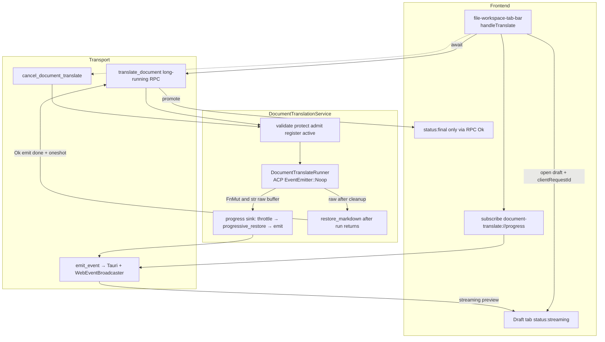

# Streaming Document Translation Preview with Complete-Token Progressive Restore

| Field | Value |
| --- | --- |
| **Status** | Draft (rev 3 — approved for implementation; trial limits ship separately) |
| **Author** | (TBD) |
| **Date** | 2026-07-20 |
| **Trial limits** | See [`2026-07-20-document-translate-trial-limits.md`](./2026-07-20-document-translate-trial-limits.md) (32k post-protect, 480s/540s timeouts) |
| **Scope** | `document_translate` backend + file-workspace FE |
| **Related modules** | `src-tauri/src/document_translate/`, `commands/document_translate.rs`, `web/handlers/document_translate.rs`, `web/event_bridge.rs`, `src/lib/document-translate.ts`, `src/lib/api.ts`, `file-workspace-tab-bar.tsx`, `workspace-context.tsx` |

---

## Overview

Codeg already supports on-demand Markdown/plain-text translation via a hidden internal agent (`ConnectionPurpose::InternalTranslate`). The path is fully request/response: the runner buffers every `ContentDelta` until `TurnComplete`, then the **service** runs fail-closed `restore_markdown`, and only then does the FE open a readonly transient result tab. For documents approaching `MAX_INPUT_SCALARS` (32 000 post-protect), wall-clock time can approach the full `DEADLINE_SECS` budget (**480 s** on the trial branch; see trial-limits doc), leaving the user on a blind toolbar spinner until streaming preview lands.

This design adds **streaming preview** without weakening final integrity:

1. Open/update a **draft translation tab** as soon as translation starts.
2. While the agent streams, progressively replace only **complete** known protect placeholders (`⟦CGCODE_<nonce>_n⟧` / `⟦CGINLINE_<nonce>_n⟧`) with original code so preview looks like a real document, not raw tokens.
3. On turn complete (after runner cleanup returns raw text), run the existing strict ordered-multiset `restore_markdown` in the **service**. Success promotes the draft to a final result via the **RPC Ok path only**; failure **fails closed** (no dirty “final” document).

Partial progressive restore is **preview quality only**. Events never sole-authorize `status: final`. The final document always requires full integrity via RPC.

---

## Background & Motivation

### Current state

| Layer | Behavior today |
| --- | --- |
| **Service** | `DocumentTranslationService::translate` validates → protect (MD) → size check → capacity-1 admit → `tokio::spawn` owned task → runner returns raw → **service** `restore_markdown` once → oneshot → return `TranslateDocumentResult`; permit dropped after restore mapping |
| **Runner** | Phased work (status, launch, lease, spawn, identity, register, prompt) then `collect_translate_output` appends `ContentDelta.text` until `TurnComplete { stop_reason: "end_turn" }`; **`cleanup_after_run` (disconnect + rmdir) always runs before `run` returns** |
| **Protect** | `protect_markdown` → `ProtectedDocument { text, nonce, placeholders }` (`placeholders` private); restore is fail-closed (`found == expected` ordered multiset) |
| **IPC** | Flat camelCase Tauri args (`content`, `format`, `locale`, `display_name`) + Axum POST `/translate_document` JSON body; FE `timeoutMs: 195_000` |
| **FE** | Toolbar awaits RPC; only on success calls `openTranslationResultTab` with full content |
| **Capacity** | Process-wide `TRANSLATE_CAPACITY = 1`, busy reject (no queue) |
| **Events** | Internal translate **ACP connection** uses `EventEmitter::Noop` (`internal_translate_event_emitter()` in `runner.rs`) so the hidden agent does **not** stream chat ACP events to the webview. There is no document-translate progress channel today. |

### Pain points

1. **Blind wait**: large docs + TTFT can look hung for minutes if deadline is raised (discussion suggested ~480 s for 32k @ ~40 tok/s + 20 s TTFT).
2. **No mid-flight feedback**: user cannot read partial translation, cancel with context, or judge quality early.
3. **Token-ugly intermediate state** (if we naïvely stream raw agent text): fenced/inline code would appear as `⟦CGCODE_…⟧` until final restore — unacceptable preview UX.
4. **Integrity vs. streaming tension**: progressive restore must never become a second integrity authority; only complete tokens may be expanded, and final restore remains fail-closed.

### What already exists to reuse

- **`emit_event` / `EventEmitter`** (`web/event_bridge.rs`): one serialize → Tauri `app.emit` + `WebEventBroadcaster` (desktop dual-path and pure server). Broadcast channel capacity **4096**.
- **Progress event pattern**: backup uses `backup://progress` + long-running RPC + `opId` correlation (`listenBackupProgress` via `getTransport().subscribe`). Cancel uses a transfer registry; for capacity-1 translate we use a **service-local** active job (see Alternatives).
- **Workspace state stream**: `folder://workspace-state-event` shows start/stop + subscribe lifecycle (heavier than needed here).
- **Transient translation tabs**: `TranslationTransientMeta`, `beginTranslateRequest` / `requestGen` stale-result guard, pin against eviction.
- **FE transport**: `subscribe(event, handler)` works for Tauri listen and WebSocket channels.

### Emitter wiring (do not confuse with ACP Noop)

| Emitter | Role after this feature |
| --- | --- |
| `internal_translate_event_emitter()` → `EventEmitter::Noop` | Unchanged. Spawn path for the hidden agent remains silent on `acp://event` / chat UI. **Do not “fix Noop”** to get translation preview. |
| `DocumentTranslationService.emitter` (from `AppState.emitter`) | **Only** path for `document-translate://progress`. Service calls `emit_event(&self.emitter, DOCUMENT_TRANSLATE_PROGRESS_EVENT, …)` so desktop gets `app.emit` + WS broadcaster and server mode gets broadcaster only. |

Implementers must not forward ACP `ContentDelta` from the internal connection to the webview; progressive text is produced only from the service progress sink over the protected buffer.

---

## Goals & Non-Goals

### Goals

1. Progressive UI: user sees growing translation text (not only a spinner) for the full wall-clock run.
2. Complete-token progressive restore: only full known placeholders expand to original code; incomplete trailing fragments stay raw or loading chrome.
3. Final fail-closed integrity unchanged: existing `restore_markdown` semantics and i18n (`I18N_PLACEHOLDER`).
4. Dual-mode parity: same service core + events work for Tauri desktop and Axum/WS server.
5. Safe capacity semantics: still capacity 1; second concurrent translate → `Busy`.
6. Cancel from admit through collect with defined draft lifecycle (no silent capacity leak; residual agent process kill still via cleanup disconnect).
7. Incremental delivery: shippable without multi-turn sectioning.

### Non-Goals (v1)

| Non-goal | Notes |
| --- | --- |
| Chunked multi-turn section translation | Future phase; listed under Alternatives |
| Letting the LLM self-strip code without protect | Integrity relies on placeholders |
| Streaming partial restore of incomplete tokens | Forbidden — would invent code from fragments |
| Changing protect token format | Keep `⟦CGCODE_/CGINLINE_<nonce>_n⟧` |
| Parallel capacity > 1 | Keep `TRANSLATE_CAPACITY = 1` |
| Raising `DEADLINE_SECS` as a hard dependency of this feature | Optional follow-up |
| Persisting draft translations to disk / DB | In-memory FE tab + process-local job only |
| Replaying missed events after WS reconnect mid-job | Best-effort live preview; final RPC still authoritative |
| Promoting tab to `final` from progress events alone | RPC Ok is sole authority for `status: final` |
| Version / capability API for feature detection | Ship BE first; degraded FE mode is draft + RPC without events |

---

## Proposed Design

### High-level architecture



### Sequence (matches real layering)

Correct control flow today and after this feature:

1. Service (request task): validate → protect → size → load agent → locale → **try_acquire permit** → **register ActiveTranslateJob** (short lock) → emit `started` → create oneshot `(tx, rx)` → **`tokio::spawn` owned task** that owns the permit (mandatory; see K15). Request task then **only** `rx.await`s the oneshot (client drop may abandon the waiter without cancelling the owned job — same as today).
2. Owned task: construct progress sink → Runner `run` (phases + collect with progress callbacks) → **always `cleanup_after_run`** → return `Result<String /* raw */, Error>` to the owned task.
3. Owned task (still holding permit): on `Ok(raw)` force last progressive emit if needed → optional `finalizing` → **strict `restore_markdown`** → emit `done`/`error`; on `Err` emit `error`/`cancelled` only → **clear ActiveTranslateJob** → **drop permit** → `tx.send(outcome)`.

```mermaid
sequenceDiagram
  participant UI as FE Toolbar
  participant Tab as Draft Tab
  participant T as Transport
  participant S as DocumentTranslationService
  participant Prog as progressive_restore
  participant R as DocumentTranslateRunner
  participant A as Hidden Agent ACP

  UI->>UI: beginTranslateRequest + clientRequestId UUID
  UI->>UI: inFlight ref = {clientRequestId, requestGen, tabId, ...}
  UI->>Tab: open draft status=streaming
  UI->>T: subscribe(document-translate://progress)
  UI->>T: translate_document flat args + clientRequestId
  T->>S: translate_document_core
  S->>S: protect_markdown if MD; size; load agent; locale
  S->>S: try_acquire capacity
  S->>S: create cancel token + jobId; short-lock insert ActiveTranslateJob
  S-->>T: emit started
  T-->>UI: started store jobId
  S->>S: oneshot; tokio::spawn owned task (owns permit+sink)
  Note over S: request task only rx.await oneshot
  S->>R: owned task: run(body, &mut sink, cancel, deadline)
  Note over R: ACP spawn uses EventEmitter::Noop
  R->>A: spawn InternalTranslate + prompt
  loop ContentDelta append-only
    A-->>R: ContentDelta{text}
    R->>R: buf.push_str; on_progress(&buf) every append
    Note over S,Prog: sink inside owned task throttles → progressive_restore + emit
    S->>Prog: progressive_restore(&buf, protected)
    S-->>T: emit streaming {previewContent, seq}
    T-->>Tab: patch iff status==streaming and clientRequestId match
  end
  A-->>R: TurnComplete end_turn
  R->>R: cleanup_after_run disconnect+rmdir
  R-->>S: Ok(raw) to owned task
  S->>S: force last progressive emit if raw non-empty
  S-->>T: emit finalizing optional
  S->>S: restore_markdown(raw, protected)
  alt integrity OK
    S-->>T: emit done {previewContent=strict final}
    S->>S: clear active; drop permit; oneshot Ok
    T-->>UI: RPC Ok (rx.await)
    UI->>Tab: status=final content=RPC translatedContent
  else integrity fail on Ok raw
    S-->>T: emit error no done
    S->>S: clear active; drop permit; oneshot Err
    T-->>UI: RPC AppCommandError
    UI->>Tab: status=failed keep last preview
  end
  Note over S,R: On run Err (timeout/cancel/abnormal): no force progressive, no finalizing/done; emit error|cancelled; clear active; drop permit; oneshot Err
  Note over UI,Tab: late streaming events ignored once terminal; client drop abandons rx only
```

### Where progressive restore runs (recommendation)

**Backend-only progressive restore** (chosen).

| Option | Pros | Cons |
| --- | --- | --- |
| **A. Backend** (chosen) | Single implementation next to `restore_markdown`; FE only renders strings; no placeholder table on the wire | Full preview string on each throttled emit |
| **B. Frontend** | Smaller delta events | Dual algorithm; large table on start; drift vs `extract_tokens` |
| **C. Hybrid** | — | Worst of both for v1 |

`ProtectedDocument` stays in the service closure that owns the progress sink. The runner does **not** call `progressive_restore` or hold `ProtectedDocument`; it only invokes `FnMut(&str)` with the append-only raw buffer.

### Progressive restore algorithm

Add in `protect.rs` (preferred: share lexer with `extract_tokens`) or sibling module re-exported from `document_translate`:

```rust
#[derive(Debug, Clone, PartialEq, Eq)]
pub struct ProgressiveRestoreView {
    /// Display text: complete known tokens expanded; trailing incomplete prefix stripped.
    pub display_text: String,
    pub restored_token_count: usize,
    pub trailing_incomplete: bool,
}

/// Preview-quality restore. Does NOT enforce ordered multiset equality.
pub fn progressive_restore_markdown(
    raw_output: &str,
    protected: &ProtectedDocument,
) -> ProgressiveRestoreView;
```

#### Lexer / scan rules (aligned with `extract_tokens`)

Assumptions and rules implementers must follow:

1. **Append-only raw buffer**: runner only appends `ContentDelta` text. Incomplete tokens exist **only as a suffix at EOF** of the current buffer (never “holes” mid-buffer from non-append edits).
2. **Reuse the same token recognition** as `extract_tokens` in `protect.rs`:
   - Open markers are multi-byte Unicode `TOKEN_OPEN` (`⟦`, U+27E6) / `TOKEN_CLOSE` (`⟧`, U+27E7).
   - Complete token = `⟦CGCODE_{nonce}_` or `⟦CGINLINE_{nonce}_` + one or more ASCII digits + `⟧`.
   - Malformed after open (no digits / no close): skip open char and continue (same as extractors today).
3. **Single left-to-right O(n) pass** building `display_text`:
   - On complete token **present in protect `HashMap<token, original>`**: append `original`, `restored_token_count += 1`.
   - On complete token **not** in table (unknown index / wrong form that still matches prefix pattern with this nonce): append the token text raw (do not invent originals).
   - On non-token prose: copy through.
4. **Trailing incomplete at EOF only**: after the scan, if the unconsumed suffix is a **proper prefix** of a well-formed token open for this nonce (e.g. ends with `⟦`, `⟦CG`, `⟦CGCODE_`, `⟦CGCODE_{nonce}_`, `⟦CGCODE_{nonce}_12` without `⟧`), set `trailing_incomplete = true` and **omit that suffix** from `display_text`. Do not expand it.
5. **Strict restore unchanged**: final path still uses ordered multiset equality via `restore_markdown`. Progressive may look “more restored” than strict will accept (duplicate unique token strings, etc.) — intentional preview vs fail-closed final.
6. **Plain text**: no protect table → identity (`display_text = raw_output`, counts 0, trailing false).

PR 1 must add **shared fixtures** that assert progressive + strict behavior on the same inputs (including incomplete suffixes and unknown complete tokens).

### Progress sink ownership and throttling (hot path)

**Critical performance rule**: do **not** run `progressive_restore` or clone the full buffer on every `ContentDelta` unconditionally.

**Construction site (mandatory)**: build the throttling progress sink **inside** the owned `tokio::spawn` task that calls `runner.run`. Do **not** borrow a mutable closure from the HTTP/Tauri request stack across the spawn boundary (that is unsound / will not compile with `'static` spawn). Preferred shapes for `async_trait` ergonomics:

```rust
// Preferred: owned callback moved into run (simple with async_trait + spawn 'static)
on_progress: Option<Box<dyn FnMut(&str) + Send>>,

// Also OK: construct `let mut sink = ...` inside the spawn block and pass
// `Some(&mut sink)` only if `run` is invoked in that same task (no cross-spawn borrow).
```

| Layer | Responsibility |
| --- | --- |
| **Owned task (service)** | Create sink closing over `ProtectedDocument`, emitter, ids, throttle state, `seq`. Pass into `run`. After `run` returns, apply terminal emit rules below. |
| **Runner** | After each append, call `on_progress(buf.as_str())` if present. Cheap. Also select on cancel/deadline. Does not own throttle policy. |
| **Service sink (during collect)** | On callback: if `now - last >= 80ms` **OR** `raw.len() - last_len >= 512`, then `progressive_restore` → `emit streaming` with monotonic `seq` → update markers. |
| **Terminal path after `run` returns** | See next table — **not** “always force progressive on every exit”. |

#### Terminal progressive / phase rules after `run`

| `run` outcome | Force last progressive emit? | `finalizing`? | Strict restore? | Terminal event |
| --- | --- | --- | --- | --- |
| `Ok(raw)` (incl. empty → EmptyOutput later) | **Yes** if raw non-empty and not yet emitted at final length (catch last throttled gap) | Optional | **Yes** (then EmptyOutput / integrity / Ok mapping) | `done` if restore Ok; else `error` (no `done`) |
| `Err(Cancelled)` | **No** | **No** | **No** | `cancelled` only |
| `Err(Timeout)` / other `Err` | **No** | **No** | **No** | `error` only |

Ordering on the **same owned task** (no concurrent emit tasks): last progressive (Ok path only) → optional `finalizing` → strict restore → terminal phase → clear active → drop permit → oneshot send.

Forbidden in v1: full-buffer `String` clone every delta; unthrottled progressive_restore every token; constructing the sink on the request task and moving a stack `&mut` into spawn.

Optional later: delta-encoded event payloads — not v1.

### Job model & service changes

#### `DocumentTranslationService`

```rust
pub struct DocumentTranslationService {
    db: Arc<AppDatabase>,
    runner: Arc<dyn DocumentTranslateAgent>,
    capacity: Arc<Semaphore>,
    emitter: EventEmitter,
    /// At most one job (capacity 1). Never hold this mutex across `.await`.
    active: tokio::sync::Mutex<Option<ActiveTranslateJob>>,
}

struct ActiveTranslateJob {
    job_id: String,
    client_request_id: String,
    cancel: tokio_util::sync::CancellationToken,
}
```

#### Owned spawn + oneshot (mandatory — disconnect safety)

**Do not** inline-await `runner.run` on the HTTP/Tauri request future.

Today `DocumentTranslationService::translate` always `tokio::spawn`s the work so that if the request future is dropped (client disconnect), the permit stays held until `run` finishes **including** `cleanup_after_run`, then restore/mapping and `drop(permit)`. Inline await on the request task is **not** equivalent: cancelling the handler cancels mid-run, can abort cleanup, and can drop the permit early (capacity leak / orphan agent).

v1 **mandates** the existing pattern:

| Task | Responsibilities |
| --- | --- |
| **Request task** (`translate` / handler) | Validate, protect, admit, register active, emit `started`, `(tx, rx) = oneshot`, `tokio::spawn` owned work, **`rx.await`** only. Client drop may end the request without cancelling the owned job. |
| **Owned task** (spawned) | Owns `permit`, builds progress sink, `runner.run(...)`, post-run progressive force (Ok only) / finalizing / strict restore / terminal emits, clear active, `drop(permit)`, `tx.send(outcome)`. |

Progress sink, strict restore, terminal emits, clear-active, and `drop(permit)` **all run inside the owned task**.

#### Active job mutex lifecycle (deadlock-safe)

**Never hold `active` across any `.await`.**

Ordered steps after successful `try_acquire_owned()`:

1. Generate `job_id = Uuid::new_v4()`, `cancel = CancellationToken::new()`, resolve `client_request_id` (param or generate server-side echo).
2. **Short lock**: `*active.lock().await = Some(ActiveTranslateJob { ... })`; unlock immediately.
3. Emit `started` (no active lock held).
4. Create oneshot; **`tokio::spawn`** owned task that moves `permit`, `cancel` clone, `protected`, emitter clone, ids, runner, etc.
5. Inside owned task only:
   - Build progress sink; call `runner.run(..., cancel, Some(sink)).await`.
   - On outcome: apply **Terminal progressive / phase rules**; clear `active` (short lock, match `job_id`); `drop(permit)`; `tx.send(...)`.
6. Request task: `match rx.await { Ok(outcome) => outcome, Err(_) => Failed("translation task ended without result") }` (same as today).

**Cancel path** (`cancel_document_translate_core`):

1. Short lock `active`.
2. If `None` → return `false`.
3. If `job_id` or `client_request_id` matches → `job.cancel.cancel()`; unlock; return `true` (idempotent: if already cancelled, still `true` when ids matched).
4. Else → return `false`.

**Registration timing**: insert active job **immediately after** permit acquire, **before** `tokio::spawn`. A cancel arriving after admit must observe the job even if the owned task has not started running yet.

**Unit tests (mandatory)**:

- Cancel immediately after admit registration (before runner produces deltas) → `Cancelled`, capacity free after cleanup.
- Cancel during collect → `Cancelled`.
- Holding pattern: cancel must not need the run task to release a long-held `active` mutex (regression: never await under `active` lock).
- Owned-spawn regression: dropping/cancelling the request future must not release capacity before cleanup completes (existing service contract; keep covered).

#### Runner trait evolution

```rust
#[async_trait]
pub trait DocumentTranslateAgent: Send + Sync {
    async fn run(
        &self,
        agent: AgentType,
        locale: AppLocale,
        body: &str,
        overall_deadline: Instant,
        cancel: CancellationToken,
        /// Constructed inside the owned spawn task and moved in.
        /// Prefer `Box<dyn FnMut(&str) + Send>` for async_trait + 'static spawn.
        mut on_progress: Option<Box<dyn FnMut(&str) + Send>>,
    ) -> Result<String, DocumentTranslateError>;
}
```

All impls must update: `DocumentTranslateRunner`, `InertDocumentTranslateAgent`, service-test `ControllableAgent` / echo agents.

#### Cancel across all phases (not only collect)

`CancellationToken` must be honored anywhere the runner already races `overall_deadline`:

| Phase | Mechanism |
| --- | --- |
| `phase(deadline, fut)` helper | Extend to `select` on `cancel.cancelled()` → `DocumentTranslateError::Cancelled` (or wrap `phase` as `phase_cancellable`) |
| `spawn_internal_with_deadline` | Add cancel arm alongside deadline; on cancel await spawn handle settle + cleanup (same orphan rules as timeout) then `Cancelled` |
| `wait_for_session_identity` | Cancel arm in existing `select` |
| `collect_translate_output` | Cancel arm next to deadline |
| Residual | Cancel does **not** instant-kill the agent OS process; `cleanup_after_run` disconnect still runs after `run` unwinds. Capacity stays held until cleanup completes (Busy window) — accepted. |

Map all cooperative exits to `DocumentTranslateError::Cancelled` (distinct i18n from timeout).

### Draft tab model (FE)

#### Correlation: dual IDs with one in-flight record

| ID | Role |
| --- | --- |
| `requestGen` (existing int per `sourceTabId`) | Tab id construction via `buildTranslationTabId`; **stale RPC ignore** when gen no longer current for source |
| `clientRequestId` (UUID string) | Wire correlation for progress events + cancel; **not** used in tab id |

```ts
// workspace ref, one in-flight translate op for the toolbar (local busy already serializes UI)
type InFlightTranslate = {
  clientRequestId: string
  requestGen: number
  sourceTabId: string
  tabId: string
  locale: string
}

// accept progress event only if:
//   event.clientRequestId === inFlight.clientRequestId
//   && tab exists && tab.transient.status === "streaming"
//   && (optional) event.seq > lastAppliedSeq
```

Helpers:

- `openTranslationDraftTab({ sourceTabId, requestGen, clientRequestId, ... })` → tabId
- `patchTranslationDraftIfStreaming(clientRequestId, patch)` — **no-op if status ≠ streaming**
- `finalizeTranslationTabFromRpc({ requestGen, sourceTabId, clientRequestId }, result | error)` — uses **requestGen** for stale RPC (existing rule) and sets terminal status
- `removeTranslationDraftTab(tabId)` — Busy / pre-admit validation failure only

#### FE terminal latch state machine

```
                 open draft
                     │
                     v
              ┌─────────────┐
     events   │  streaming  │◄── only state that accepts started/streaming/finalizing patches
              └──────┬──────┘
         RPC Ok      │      RPC err / cancel
              ┌──────┴──────┐
              v             v
         ┌────────┐   ┌──────────┐
         │ final  │   │ failed / │
         └────────┘   │cancelled │
                      └──────────┘
```

Rules:

1. Once `status ∈ { final, failed, cancelled }`, **ignore all** non-matching or late `started` / `streaming` / `finalizing` / even late `done` content patches for that tab.
2. Optional: track `lastAppliedSeq` from event `seq`; ignore `event.seq <= lastAppliedSeq`.
3. **`status: final` only on RPC Ok** with matching `requestGen`. A `done` event may update chrome (e.g. show “complete”) but **must not** alone set `final` or overwrite content if RPC has not succeeded (defense against treating progressive/done as integrity-checked).
4. On RPC Ok: set content to `translatedContent` from RPC (authoritative), `status: final`.
5. Backend should emit terminal phase after last progressive emit on the same task; FE remains fail-safe under reordering/async handlers.

#### Lifecycle table

| Event | Tab behavior |
| --- | --- |
| User clicks Translate | `beginTranslateRequest` → `requestGen`; new UUID `clientRequestId`; set `inFlight`; open draft `streaming`; toolbar busy; subscribe if needed |
| `started` | If streaming + id match: store `jobId`, `expectedTokens` |
| `streaming` / `finalizing` | If streaming + id match (+ seq): patch `previewContent` / badge |
| `done` event | May refresh chrome only; **do not** set `final` |
| RPC success | If `requestGen` current: `final` + RPC content; clear `inFlight` if same id |
| RPC / terminal `error` | `failed`; keep last preview; toast; clear inFlight |
| User cancel | `cancel_document_translate`; on RPC/`cancelled`: `cancelled`; keep partial |
| Second click local busy | Ignored (`translateBusyRef`) |
| Close draft mid-stream | **v1: does NOT cancel the job** (decided). Job runs to completion/timeout; capacity held until done. Follow-up may add cancel-on-close. |
| Save as | Only `status === "final"` |

#### Optimistic draft vs Busy / multi-client matrix

Process-wide capacity 1: Busy can come from **another window or WS client** while this FE is not locally busy.

| Outcome | When | Draft tab | `requestGen` | Toolbar busy | Events |
| --- | --- | --- | --- | --- | --- |
| Pre-admit validation (empty, too large, unsupported, agent missing) | Before/at admit | **Remove** optimistic draft by `inFlight.tabId` | Leave gen as-is (stale for any late result) | `finally` clear | Usually none |
| **Busy** | `try_acquire` fails | **Remove** draft (do not leave `streaming` orphan) | Same | `finally` clear | none |
| Post-admit error (timeout, integrity, spawn, …) | After admit | Keep tab, `failed` | Same | `finally` clear | `error` |
| Cancel | User | Keep tab, `cancelled` | Same | `finally` clear | `cancelled` |
| Success | | `final` | Same | `finally` clear | `done` + RPC |

Always clear local `translateBusy` / `translateBusyRef` in `finally`.

**Multi-window / multi-client event visibility**: `emit_event` is process-broadcast (same as backup). **Every** listener sees every job’s progress. FE **must** filter by its own `clientRequestId` (not optional). Second window that did not start the job must not open/patch drafts for foreign ids. If both windows click translate, one gets Busy and removes its optimistic draft.

#### Save as gate (FE + defense note)

- UI: enable Save as only when `transient?.type === "translation" && transient.status === "final"` (today only checks type — change required).
- Component tests: streaming / failed / cancelled tabs hide or disable Save as.
- Backend `save_translation_as` remains **content-agnostic** (exclusive create under folder root only). A user could still paste progressive text via a crafted invoke — acceptable for single-user desktop; integrity is a product/UI guarantee, not a server crypto boundary.

#### Markdown preview while streaming

Today final tabs enable markdown preview mode. Incomplete fences mid-stream thrash the preview renderer.

- **v1 default**: while `status === "streaming"`, keep **source/editor** view (do not add to `previewFileTabIds`); on `final`, enable markdown preview as today.
- Optionally throttle FE `setState` to ~80 ms to match backend emit cadence.
- Polish (PR 5) can refine spinner/badge without protocol change.

### Timeout interaction

| Clock | Owner | Behavior |
| --- | --- | --- |
| `DEADLINE_SECS` (120 today) | Backend from service entry | Unchanged wall-clock; cleanup outside budget |
| Progressive emits | Same deadline | Stop on timeout; emit `error`; capacity through cleanup |
| FE `timeoutMs: 195_000` | `translateDocument` | Must stay ≥ backend deadline + cleanup slack; if deadline → 480 s, FE → ≥510 s |
| Client disconnect mid-RPC | Owned spawn keeps permit | Events may continue for other subscribers |

Streaming does not extend the deadline.

### Error / cancel semantics for partial drafts

| Condition | RPC | Events | Draft tab | Capacity |
| --- | --- | --- | --- | --- |
| Success + restore OK | `TranslateDocumentResult` | `done` (strict content) after cleanup+restore | `final` **via RPC only** | clear active → drop permit |
| Placeholder integrity | `PlaceholderIntegrity` | `error` only (**no `done`**) | `failed`, last progressive preview may look fully expanded | same |
| Timeout | `Timeout` | `error` | `failed` | same |
| User cancel | `Cancelled` | `cancelled` | `cancelled` | same |
| Busy | `Busy` | none | **remove** optimistic draft | unchanged |
| Pre-admit validation | domain error | none | **remove** draft | unchanged |
| Interactive / spawn / empty / output too large | domain errors | `error` if post-admit | `failed` | released |
| Stale `requestGen` | FE ignores RPC | FE ignores foreign/stale events | prior tab unaffected | N/A |

#### Cancelled vs Timeout i18n

Today both map to `I18N_TIMEOUT` / “timed out” (`types.rs` `into_app_command_error`).

| Error | `AppErrorCode` | i18n key | Message |
| --- | --- | --- | --- |
| `Timeout` | `TaskExecutionFailed` (keep) | `I18N_TIMEOUT` | timed out (unchanged) |
| `Cancelled` | `TaskExecutionFailed` (keep unless product wants a dedicated code later) | **`I18N_CANCELLED`** new stable key under `Folder.fileWorkspace` | e.g. “Document translation was cancelled” |

Unit test: `Cancelled.into_app_command_error()` has distinct `i18n_key` from `Timeout`. Implement in PR 2 or PR 3a with types change.

### Event channel & payload

```rust
pub const DOCUMENT_TRANSLATE_PROGRESS_EVENT: &str = "document-translate://progress";
```

```rust
#[derive(Debug, Clone, Serialize)]
#[serde(rename_all = "camelCase")]
pub struct DocumentTranslateProgressEvent {
    pub client_request_id: String,
    pub job_id: String,
    pub phase: DocumentTranslatePhase,
    /// Monotonic per job; FE may use for reorder safety.
    pub seq: u64,
    /// Streaming: progressive preview. Done: strict-restored final only.
    #[serde(skip_serializing_if = "Option::is_none")]
    pub preview_content: Option<String>,
    #[serde(skip_serializing_if = "Option::is_none")]
    pub raw_chars: Option<usize>,
    #[serde(skip_serializing_if = "Option::is_none")]
    pub restored_tokens: Option<usize>,
    #[serde(skip_serializing_if = "Option::is_none")]
    pub expected_tokens: Option<usize>,
    #[serde(skip_serializing_if = "Option::is_none")]
    pub trailing_incomplete: Option<bool>,
    #[serde(skip_serializing_if = "Option::is_none")]
    pub locale: Option<String>,
    #[serde(skip_serializing_if = "Option::is_none")]
    pub format: Option<DocumentTranslateFormat>,
    #[serde(skip_serializing_if = "Option::is_none")]
    pub error_i18n_key: Option<String>,
}

#[derive(Debug, Clone, Serialize)]
#[serde(rename_all = "camelCase")]
pub enum DocumentTranslatePhase {
    Started,
    Streaming,
    Finalizing,
    Done,
    Error,
    Cancelled,
}
```

#### Phase / payload rules (wire freeze)

| Phase | When | `preview_content` |
| --- | --- | --- |
| `started` | After active-job register, before/at owned-task start | omit (or empty) |
| `streaming` | Throttled during collect; plus **one forced** progressive emit when `run` returns `Ok(raw)` and raw non-empty (if final length not yet emitted) | **Progressive** restore only |
| `finalizing` | **Optional**, only on `Ok(raw)`, after forced progressive, before strict restore | last progressive snapshot optional; FE shows spinner badge |
| `done` | **Only if** `run` Ok **and** `restore_markdown` Ok | **Must be strict-restored final string** (same as RPC `translatedContent`). Never progressive-only. |
| `error` | `run` Err (non-cancel), EmptyOutput, OutputTooLarge, integrity, etc. | omit body (FE keeps last streaming preview if any); **no** forced progressive / **no** `finalizing` / **no** `done` on pure `run` Err |
| `cancelled` | `run` returned `Cancelled` | omit body; **no** forced progressive / **no** `finalizing` / **no** `done` |

**Integrity failure after a “fully expanded” progressive preview** (wrong order / duplicates with unique token strings): last streaming preview may look complete; then `error` + RPC `PlaceholderIntegrity`. Intentional; FE keeps `failed` with that preview and toasts integrity i18n.

FE: `done` may update chrome; **`status: final` only on RPC Ok**.

### Exact API surface

#### Extend `translate_document` (flat Tauri + JSON HTTP)

**HTTP** `POST /translate_document` body (`TranslateDocumentParams`, camelCase):

```json
{
  "content": "...",
  "format": "markdown",
  "locale": "zh_cn",
  "displayName": "README.md",
  "clientRequestId": "uuid-optional"
}
```

**Tauri command** (flat args matching FE `invoke` / `api.ts` — same convention as today):

```rust
pub async fn translate_document(
    content: String,
    format: String,
    locale: Option<String>,
    display_name: Option<String>,
    client_request_id: Option<String>, // NEW
    service: State<'_, Arc<DocumentTranslationService>>,
) -> Result<TranslateDocumentResult, AppCommandError>
```

**Result** (optional echoes):

```rust
pub struct TranslateDocumentResult {
    pub translated_content: String,
    pub locale: String,
    pub format: DocumentTranslateFormat,
    pub job_id: Option<String>,
    pub client_request_id: Option<String>,
}
```

#### New `cancel_document_translate`

**HTTP** `POST /cancel_document_translate`

**Tauri**:

```rust
pub async fn cancel_document_translate(
    client_request_id: Option<String>,
    job_id: Option<String>,
    service: State<'_, Arc<DocumentTranslationService>>,
) -> Result<bool, AppCommandError> // true if matched active job and cancel signaled
```

FE: `getTransport().call("cancel_document_translate", { clientRequestId?, jobId? })`.

At least one id should be provided; if both, match if **either** equals active job (document exact: prefer job_id if both set, else client_request_id — implement as: match if `job_id.as_ref() == Some(&active.job_id) || client_request_id.as_ref() == Some(&active.client_request_id)`).

#### Construction / registration

- `build_production_document_translation_service(db, connection_manager, registry, data_dir, emitter: EventEmitter)`
- Desktop `lib.rs` + `codeg_server.rs` + test `AppState` inert path: pass `EventEmitter::Noop` or real emitter.
- Register Tauri commands: existing + `cancel_document_translate`.
- Router: `POST /cancel_document_translate` next to translate routes.

#### Unchanged

- `save_translation_as` flat args / exclusive create.

### Compatibility / degraded modes

| Client | Behavior |
| --- | --- |
| Old FE, new BE | Blocking translate works; events ignored |
| New FE, old BE | No progress events; draft stays empty/loading until RPC resolves then promote/fail — **acceptable degraded mode**. Cancel invoke fails → toast no-op / “unavailable”, do not hang. **No version API** for v1. |

Ship **backend first** (PR 1–3), then FE (PR 4).

---

## API / Interface Changes

### Backend

| Item | Change |
| --- | --- |
| `types.rs` | `client_request_id`; progress types + `seq`; result echoes; `I18N_CANCELLED` + mapping test |
| `protect.rs` | shared lexer + `progressive_restore_markdown` + fixtures |
| `runner.rs` | `FnMut(&str)` progress; cancel in all phases; trait + all impls |
| `service.rs` | emitter, active job short locks, throttle sink, phases, cancel API |
| `commands/document_translate.rs` | flat `client_request_id`; `cancel_document_translate` flat args |
| `web/handlers` + `router.rs` | cancel route |
| `lib.rs` / `codeg_server` / builders | pass `EventEmitter` into service |

### Frontend

| Item | Change |
| --- | --- |
| `api.ts` | `clientRequestId`; listen/cancel helpers; timeout note |
| `document-translate.ts` | status types; helpers |
| `workspace-context.tsx` | draft/patch/finalize/remove; inFlight ref |
| `file-workspace-tab-bar.tsx` | draft open; subscribe; Save gate; cancel UX |
| i18n | **PR 4: `en` + `zh-CN` only** for new keys; remaining locales in polish PR |
| Tests | races: late streaming after final; Busy removes draft; Save disabled when non-final |

### Before / after UX

**Before**: click → spinner → full tab or toast.

**After**: click → draft tab → progressive text (editor view while streaming) → RPC promotes to final (preview on) or failed/cancelled with last preview → Save only when final.

---

## Data Model Changes

### Process memory only (no DB migration)

- `ActiveTranslateJob` behind short-held mutex (≤1 entry).
- No SQLite migration; `InternalSessionPurpose::Translate` already exists.

### Migration / compatibility

Optional `clientRequestId` on wire. Backend still emits if FE omits (server-generated id; FE that did not pass id cannot filter unless it reads `started` — new FE always sends UUID).

---

## Alternatives Considered

### 1. Chunked multi-turn section translation (future)

Deferred: integrity and capacity complexity.

### 2. FE-only progressive restore

Rejected: dual algorithm + table on wire.

### 3. Fire-and-forget start + terminal event only

Rejected for v1: backup-style long RPC preferred; no snapshot store for missed `done`.

### 4. Stream partial token restore

Forbidden.

### 5. Raise deadline only

Insufficient alone.

### 6. Reuse `WorkspaceTransferManager` / backup cancel registry

Backup cancel uses a multi-op transfer registry. Document translate is **capacity 1** with a single permit. A service-local `Option<ActiveTranslateJob>` + `CancellationToken` is enough, avoids coupling to workspace transfer, and keeps cancel latency to one short mutex. **Rejected** shared transfer manager for v1.

### 7. Delta-encoded progress payloads

Send only newly appended progressive slice. Deferred optimization under payload-size risk; full snapshot each throttled emit is simpler and fine at ≤96 KiB raw.

---

## Security & Privacy Considerations

| Threat / concern | Mitigation |
| --- | --- |
| Event leakage of document content over WS | Same auth as other broadcaster channels; server token |
| Cross-user cancel | Single-tenant process model; capacity 1 |
| PII in logs | Log ids, phases, lengths — not full bodies at info |
| Integrity bypass via progressive / Save | FE status gate; events never set `final`; backend save content-agnostic by design (single-user) |
| Placeholder table exfiltration | Not shipped |
| Cancel races | Token + cleanup disconnect; Busy until permit drop |
| Broadcast visibility | FE must filter `clientRequestId` (required) |

---

## Observability

### Logging (`tracing`) — v1

- `info`: job start/end, `job_id`, format, locale, expected_tokens, duration_ms, outcome
- `debug`: emit counts, throttle skips, raw_chars milestones
- `warn`: integrity, stream lag/closed, cancel during cleanup
- Never log full document / preview bodies at info

### Metrics

**Out of scope for v1.** No new metrics hub integration required; structured logs only. Revisit later if a process-wide metrics pattern is adopted for similar features.

### Alerting

None required for v1.

---

## Rollout Plan

1. BE progressive restore + events + cancel (no flag; old FE ignores events).
2. FE draft + subscribe; degraded without events OK.
3. Desktop nightly → server/docker.
4. Rollback: FE ignore events / flag off; BE stop emitting without breaking RPC.
5. Deadline bump: separate PR; FE `timeoutMs` lockstep.

---

## Testing Strategy

### Unit — progressive restore

| Case | Expect |
| --- | --- |
| Empty raw | empty, 0 restored |
| Prose only | identity |
| Partial token at EOF | stripped, `trailing_incomplete` |
| One complete known token | restored |
| Unknown complete token | left raw |
| Wrong order all complete | progressive may expand; strict fails |
| Duplicate token string | progressive may expand both; strict fails |
| Shared fixtures with `extract_tokens` well-formedness | same complete set |
| Multi-byte open/close around partial suffix | no panic / correct strip |
| Plaintext | identity |
| ~96 KiB synthetic | O(n) single pass |

### Unit — service / runner

| Case | Expect |
| --- | --- |
| Multi-chunk deltas | throttled streaming emits; progressive not every delta |
| Integrity after stream | `error` not `done`; RPC PlaceholderIntegrity; permit free |
| Cancel **immediately after admit** | Cancelled; no deadlock; **no** `finalizing`/`done` |
| Cancel during pre-collect phase (e.g. blocked spawn gate) | Cancelled enters cleanup; no force progressive |
| Cancel mid-collect | Cancelled; no force progressive |
| Timeout / other `run` Err | `error` only; no force progressive / no `finalizing` |
| Ok path with throttled gap | force last progressive then optional finalizing then done |
| Busy second call | Busy |
| Noop emitter | success without subscribers |
| `test_web_only` phase order | `started → streaming* → (finalizing? only on Ok) → done\|error\|cancelled` |
| `Cancelled` i18n ≠ `Timeout` | unit on `into_app_command_error` |
| Owned spawn disconnect contract | dropping request waiter does not free capacity before owned cleanup |

### Integration / FE

| Case | Expect |
| --- | --- |
| Draft opens before RPC resolve | streaming |
| Progress patches content | yes |
| Late streaming after final | **no overwrite** |
| RPC success → final + Save enabled | yes |
| failed/cancelled Save disabled | yes |
| Busy removes draft | no leftover streaming |
| stale requestGen | ignore RPC/events |
| api payload `clientRequestId` | yes |

### Manual

Large MD fences; timeout; desktop + server; two windows (Busy + filter).

---

## Risks

| Risk | Severity | Mitigation |
| --- | --- | --- |
| FE late `streaming` overwrites `final` | **High** | Terminal latch; ignore non-streaming patches; optional seq |
| `active` mutex held across await → cancel deadlock | **High** | Short critical sections only; tests |
| Unthrottled progressive_restore every delta | **High** | Throttle before progressive + emit; owned `Box<FnMut>` / `&str` callback |
| **Inline-await `run` on request task** | **High** | **Forbidden**; mandate owned `tokio::spawn` + oneshot (K15); cleanup + capacity hold on disconnect |
| Progress sink borrowed across spawn | Medium | Construct sink **inside** owned task only |
| Full preview payload size | Medium | 80 ms / 512 B throttle; later delta encoding |
| Preview vs final mismatch | Medium | RPC content on promote; finalizing badge |
| Duplicate-token preview then integrity fail | Low | Toast; fail closed; no `done` |
| FE timeout < deadline after bump | High if uncoupled | Lockstep constants |
| Cancel does not kill agent instantly | Medium | cleanup disconnect; Busy until free |
| Pre-collect cancel gap (if incompletely wired) | Medium | Cancel in every phase select |
| Close tab without cancel wastes capacity | Low | v1 accepted; document |
| Markdown preview thrash while streaming | Low | Editor view until final |

---

## Open Questions

1. **Should `DEADLINE_SECS` move to 480 with streaming?** Recommendation: separate PR after preview lands. **Still open.**
2. **Cancel control placement**: draft banner vs toolbar stop? Recommendation: draft banner + local busy disables Translate. **Still open (UX only).**
3. **Does closing the draft tab cancel the job?** **Decided v1: NO.** Closing the draft does not cancel; job continues until complete/timeout/error; capacity held. Future may add cancel-on-close.
4. **Multi-window both receive broadcasts**: Acceptable under single-tenant model; FE filters by `clientRequestId`; second click gets Busy and removes optimistic draft. **Accepted.**
5. **`done` body content?** **Decided:** `done.previewContent` **may** carry **strict-restored** final text (duplicate of RPC) for chrome/consistency. FE **still only** sets `status: final` from **RPC Ok**. Never put progressive-only text in `done`.
6. **i18n catalogs for new keys?** **Decided:** PR 4 ships **`en` + `zh-CN`**; remaining locales in polish PR (PR 5).

---

## References

- `src-tauri/src/document_translate/service.rs` — admit, protect, **post-run** restore, capacity, owned spawn
- `src-tauri/src/document_translate/protect.rs` — `protect_markdown` / `restore_markdown` / `extract_tokens`
- `src-tauri/src/document_translate/runner.rs` — phases, `collect_translate_output`, **cleanup before return**, `internal_translate_event_emitter` → Noop
- `src-tauri/src/document_translate/types.rs` — limits, errors, prompt
- `src-tauri/src/web/event_bridge.rs` — `emit_event`, broadcast 4096
- `src-tauri/src/commands/backup/` — progress + long RPC pattern (not transfer registry reuse)
- `src/lib/platform.ts` — `subscribe`
- `src/lib/api.ts` — `translateDocument` timeout, `listenBackupProgress`
- `src/lib/document-translate.ts` — eligibility, transient meta, tab ids
- `src/contexts/workspace-context.tsx` — `openTranslationResultTab`, `beginTranslateRequest`
- `src/components/files/file-workspace-tab-bar.tsx` — translate / save UX

---

## Key Decisions

| # | Decision | Rationale |
| --- | --- | --- |
| K1 | Long-running `translate_document` RPC + `document-translate://progress` events | Matches backup; dual-mode `emit_event`; keeps `AppCommandError` |
| K2 | Progressive restore on backend in service sink | Private placeholders; no dual algorithm |
| K3 | Complete-token only; trailing incomplete stripped at EOF | No invented code; append-only buffer |
| K4 | Draft opens on click; Save only for `final` | No blind spinner; no integrity-unchecked save |
| K5 | `requestGen` = tab id + stale RPC; `clientRequestId` = wire events/cancel | Clear dual-correlation; inFlight ref is FE source of truth for live op |
| K6 | Capacity 1; `CancellationToken` end-to-end phases | Cancel mid-wait not only mid-collect |
| K7 | Strict `restore_markdown` sole integrity authority | Progressive never promotes |
| K8 | Throttle **before** progressive_restore + emit (80 ms / 512 B); `&str` callback | Avoid O(n) per token and full-buffer clones |
| K9 | Deadline bump out of band | Streaming independently valuable |
| K10 | **Events never sole completion authority** for `status: final` | Prevents integrity skip and late-event races; RPC Ok only |
| K11 | **Register `ActiveTranslateJob` immediately after admit**; never await under `active` lock | Cancel observability + no deadlock |
| K12 | ACP connection stays `EventEmitter::Noop`; progress uses service emitter only | Avoid wrong “fix Noop” wiring |
| K13 | `done.previewContent` = strict final only; integrity → `error` only | Wire freeze for PR 3 |
| K14 | Close-tab does not cancel (v1); i18n en+zh-CN in PR 4 | Product locks from review |
| K15 | **Mandatory owned `tokio::spawn` + oneshot**; never inline-await `run` on the request task | Preserves disconnect safety: permit + cleanup held until owned task finishes even if client drops; matches current `service.rs` |
| K16 | Progress sink constructed **inside** owned task; prefer `Box<dyn FnMut(&str) + Send>` | Avoids cross-spawn borrows / `async_trait` footguns |
| K17 | Force last progressive emit **only** on `Ok(raw)`; `Err` → terminal `error`/`cancelled` only (no `finalizing`/`done`) | Clear phase-order tests; no wasted work on cancel/timeout |

---

## PR Plan

Ordered, each independently reviewable and green on CI.

### PR 1 — Progressive restore pure API

- **Title**: `document_translate: add complete-token progressive_restore`
- **Files**: `protect.rs` (refactor shared lexer with `extract_tokens` as needed), tests/fixtures
- **Deps**: none
- **Description**: `progressive_restore_markdown` + `ProgressiveRestoreView`. Shared fixtures with strict restore. No service wiring.

### PR 2 — Runner progress hook + cancel in all phases

- **Title**: `document_translate: raw progress callback and cancellable phases`
- **Files**: `runner.rs`, `types.rs` (`I18N_CANCELLED` mapping + unit test if included here), all `DocumentTranslateAgent` impls including test doubles in `service.rs` tests
- **Deps**: PR 1 not required for raw callback
- **Description**: Prefer `Option<Box<dyn FnMut(&str) + Send>>` moved into `run` (or `&mut` only when caller and `run` share one task). Call after each append; `CancellationToken` in `phase`, spawn-with-deadline, identity wait, collect. Map to `Cancelled`. User-reachable cancel still needs PR 3b.

### PR 3a — Service progress events + clientRequestId (no cancel command yet)

- **Title**: `document_translate: emit document-translate://progress with throttled progressive preview`
- **Files**: `service.rs`, `types.rs` (event types, `client_request_id` on params/result), `commands/document_translate.rs` (flat `client_request_id`), builders/`lib.rs`/`codeg_server` pass `EventEmitter`, handler params only
- **Deps**: PR 1 + PR 2
- **Description**: **Keep owned `tokio::spawn` + oneshot** (no inline await). Build throttle sink **inside** spawn; progressive_restore → emit; force last progressive **only** on `Ok(raw)`; `Err` → `error`/`cancelled` only. `seq`; phases; strict restore after run inside owned task; register `ActiveTranslateJob` after admit. Tests: `test_web_only` phase order, Noop success, integrity after stream, Busy, multi-chunk throttle, cancel/timeout emit no `finalizing`/`done`.

### PR 3b — Cancel command + ActiveTranslateJob cancel path

- **Title**: `document_translate: cancel_document_translate`
- **Files**: service cancel core, `commands/document_translate.rs` flat cancel, `web/handlers` + `router.rs` `POST /cancel_document_translate`, FE can wait for PR 4
- **Deps**: PR 3a
- **Description**: Short-lock cancel; tests cancel after admit + mid-stream; capacity free after cleanup.

*(If team prefers one PR: merge 3a+3b but treat the test checklist as merge gate.)*

### PR 4 — FE draft tabs + listeners

- **Title**: `fe: streaming translation draft tabs with progressive preview`
- **Files**: `api.ts`, `document-translate.ts`, `workspace-context.tsx`, `file-workspace-tab-bar.tsx`, tests, **i18n `en` + `zh-CN` only**
- **Deps**: PR 3a (events); cancel button needs 3b
- **Description**: inFlight correlation; terminal latch; Busy removes draft; Save gate; editor view while streaming; degraded mode without events; cancel errors toast no-op on old BE.

### PR 5 — Polish

- **Title**: `document_translate: streaming UX polish + remaining i18n locales`
- **Files**: badge/spinner, remaining locale catalogs, optional FE setState throttle, structured log tweaks
- **Deps**: PR 4
- **Description**: No protocol breaks. **Not** cancel-on-close unless product reopens Q3.

### PR 6 — Follow-up deadline bump

- **Title**: `document_translate: raise DEADLINE_SECS and FE timeout together`
- **Files**: `types.rs`, `api.ts`, tests
- **Deps**: PR 4 recommended
- **Description**: e.g. 480 s + ≥510 s client timeout.
