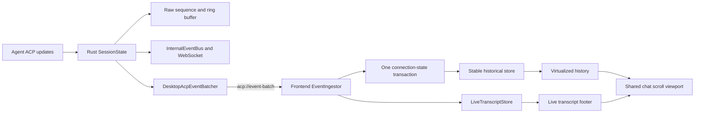

# WebView Streaming Performance Optimization Design

Date: 2026-07-16

Status: Direction approved; pending written-spec review

## Summary

Keep the existing Tauri, React, and WebView frontend and optimize the live chat
path. The selected design replaces per-envelope UI work with bounded desktop
event batches, applies each batch as one frontend transaction, separates the
stable history from the active reply, and renders only the unfinished Markdown
tail in a lightweight form.

The work targets the reported symptom where a fast Grok response pauses and
then jumps forward, especially around code, tables, and tool activity. It does
not remove server mode, replace the frontend framework, or change the editor.

The design builds on existing project safeguards:

- `EventBusMetrics` already reports backend event volume and queue pressure.
- connection and runtime-store tests already assert that streaming-only state
  does not re-render unrelated consumers.
- Streamdown already memoizes stable top-level blocks and heavy plugins are
  warmed outside the first streaming use where possible.

Those mechanisms remain useful, but they do not measure Rust-to-paint latency,
main-thread stalls, layout work, or real WebView frame behavior. The first
delivery phase extends them instead of creating a separate observability stack.

## Problem

The desktop live path is currently:

```text
ACP update
  -> SessionState apply + sequence
  -> one Tauri app.emit per EventEnvelope
  -> one JavaScript callback per envelope
  -> frontend queue and reducer dispatches
  -> canonical LiveMessage replacement
  -> conversation runtime replacement
  -> timeline reconstruction
  -> live-turn adaptation and grouping
  -> Streamdown / tool rendering
  -> virtualizer measurement and scroll correction
```

Several costs compound under a high-rate agent:

1. `emit_with_state` calls `app.emit("acp://event", ...)` for every envelope.
2. The frontend queues text for 16 ms, but a queue of 256 flushes immediately.
3. Tool and control events force the text queue to flush early.
4. Every accepted envelope separately advances `EVENT_APPLIED`.
5. Every live-message replacement invalidates the session-keyed timeline cache.
6. The timeline and message-list paths scan historical and live turns again.
7. Streamdown protects completed blocks, but normalization and top-level block
   discovery still begin from the growing source string.
8. Live code and some tool surfaces can repeatedly request highlighting for a
   growing source.
9. Height changes feed the virtualizer, ResizeObserver, and stick-to-bottom
   behavior while the main thread is already busy.

The existing tests verify selected reference-stability and render-count
invariants. They do not put a high-rate event stream through the complete path
or identify which stage produced a visible pause.

## Goals

1. Eliminate pause-then-jump behavior during high-rate Grok output.
2. Keep input, selection, scrolling, permissions, and cancellation responsive.
3. Bound WebView update frequency without losing or reordering ACP events.
4. Keep historical message rendering inactive while the current reply grows.
5. Parse and highlight stable rich content once instead of per appended batch.
6. Preserve final Markdown, tools, plans, usage, and transcript semantics.
7. Add reproducible measurements that run through the actual desktop path.
8. Ship each major optimization behind an independently removable internal
   flag until its correctness and performance gates pass.

## Non-Goals

- Adopting or prototyping EUI-NEO.
- Removing the Axum server, WebSocket transport, or Docker deployment.
- Replacing Tauri or React.
- Optimizing Monaco, file watching, editor diff decorations, or xterm globally.
- Changing ACP, MCP, SSE, or agent wire protocols.
- Redesigning the chat UI or altering completed-message appearance.
- Recording real user prompts or replies as part of normal telemetry.
- Guaranteeing a fixed FPS on every supported device independent of hardware.

## Performance Contract

The reference workload is a deterministic synthetic turn containing:

- 30,000 final text characters;
- prose and CJK text;
- a long fenced source block split across many chunks;
- a growing GFM table;
- math delimiters and a Mermaid fence;
- at least 50 tool create/update/finalize events;
- interleaved text, thinking, tool, plan, and control events;
- profiles at 100, 500, and 1,000 incoming envelopes per second.

The primary reference environment is a release-like Windows WebView2 desktop
build with hardware acceleration enabled. macOS WKWebView and Linux WebKitGTK
receive functional and qualitative smoke coverage; absolute timing gates are
reported separately because the engines and hardware differ.

Acceptance targets on the reference environment are:

| Metric | Target |
| --- | --- |
| Batch receipt to next paint, P95 | less than 100 ms |
| Input event to next paint, P95 | less than 50 ms |
| Main-thread long task | no task over 200 ms |
| Active-output visual cadence | at least 30 updates per second while sufficient input is queued |
| Event integrity | no loss, duplicate application, or reordering per connection |
| Final output | semantically identical Markdown and tool state |

Absolute performance thresholds are release gates on a named reference
machine, not on shared CI. CI uses deterministic event-integrity, render-count,
and bounded-work assertions so host load does not make tests flaky.

## Target Architecture



The backend remains authoritative for session state and sequencing. The live
transcript store is an incremental UI projection, not a second transcript or a
persistence source.

## 1. Measurement And Replay

### Existing Infrastructure To Reuse

Extend `EventBusMetrics` with desktop-delivery counters rather than adding a
metrics framework:

- raw ACP envelopes offered to the desktop batcher;
- emitted desktop batch count;
- total events and bytes in desktop batches;
- largest batch event and byte counts;
- desktop batcher queue-full count;
- desktop serialization or emit failures.

Keep the existing `/api/debug/event_metrics` snapshot for server operators.
Expose the same process-local snapshot to desktop diagnostics through a Tauri
command so measuring desktop mode does not depend on the HTTP server.

Keep the current render-count and reference-stability tests. They remain the
fast CI guard for unrelated component churn.

### Synthetic Fixture

Add a development/test-only ACP performance fixture with deterministic payload
content and event timing. It must not read a real agent transcript or user
session. A desktop-only replay command injects the fixture before the same
desktop batcher used by live ACP events, so the test includes serialization,
Tauri delivery, JavaScript ingestion, React, Markdown, layout, and paint.

The replay accepts only predefined fixture IDs and rate profiles. It is absent
from release command registration unless an explicit test-utils build enables
it.

### Frontend Timing

Record these marks for every batch and aggregate them after a run:

```text
batch received
  -> event transaction complete
  -> live store publication
  -> React commit
  -> next animation frame
```

Use `PerformanceObserver` for long tasks when supported. Fall back to animation
frame gaps and event-loop drift on WebViews that do not expose the long-task
entry type. Measure input latency with a synthetic input marker that does not
insert text into a user's real composer.

Each run produces a JSON report containing fixture version, platform, WebView
version where available, build mode, hardware-acceleration state, batch
statistics, timing percentiles, frame gaps, and acceptance results.

No production analytics upload is added. Reports stay local and are generated
only by an explicit development or test run.

## 2. Desktop Event Batching

### Delivery Boundary

Retain the existing per-event work under the `SessionState` write lock:

1. apply the event;
2. increment `event_seq`;
3. create the `EventEnvelope`;
4. append it to the recent-event ring.

Retain raw per-envelope delivery to the per-connection stream and
`InternalEventBus`. Server and remote clients therefore keep their current
snapshot, replay, and WebSocket behavior.

Replace only the desktop `app.emit("acp://event", envelope)` call with enqueue
into one application-managed `DesktopAcpEventBatcher`. The batcher emits
`acp://event-batch` with an ordered array of unmodified `EventEnvelope` values.

### Initial Batch Policy

Flush when the first of these conditions is met:

- 16 ms since the first queued event;
- 128 queued envelopes;
- 64 KiB of estimated serialized payload;
- a flush-sensitive control event is appended;
- application shutdown.

Flush-sensitive control events are permission requests, question requests,
turn completion, and errors. They flush all preceding events in the same order
and add at most one frame of normal latency. Tool-call and tool-call-update
events do not force a flush.

The initial implementation sends raw envelopes in the batch and does not merge
text on the Rust side. This keeps sequencing and subscriber equivalence easy to
prove. Wire-level adjacent-delta compaction is a later optimization only if
measurements show JSON object overhead remains significant.

### Backpressure And Failure

Use a bounded Tokio channel. If it reaches capacity, increment a metric and
await capacity after the `SessionState` lock has been released. Do not drop a
control event or silently skip a text delta.

Keep the legacy path behind one internal runtime flag for one release cycle.
The backend selects batch or legacy mode once during startup, exposes that mode
to the frontend, and the frontend subscribes to exactly one event name. If the
batcher cannot initialize, startup selects legacy mode and records the fallback.

Do not hot-switch event names after connections are active. If the selected
batcher task fails at runtime, stop advancing desktop delivery, emit a separate
low-frequency delivery-failure signal, and make the frontend recover the
affected connections before selecting a new mode. A desktop process must never
continue with a half-active batch and single-event listener pair that could
lose or duplicate events.

## 3. Frontend Event Ingestion

Introduce a non-React `EventIngestor` that owns the desktop batch subscription,
per-connection receive cursor, and pending browser-frame work.

For each delivered batch it:

1. maps connection IDs to context keys once;
2. rejects envelopes at or below the connection cursor;
3. detects an unexpected sequence gap before advancing the cursor;
4. compacts adjacent text and thinking deltas without crossing another event;
5. preserves ordered tool updates and append semantics;
6. applies all accepted events in one connection-store transaction;
7. advances `lastAppliedSeq` once to the highest accepted sequence;
8. mirrors the final live-message reference once per changed connection;
9. notifies render-relevant connection listeners once;
10. invokes raw `useAcpEvent` subscribers in original order after commit.

If multiple Tauri batches arrive before the next animation frame, the ingestor
drains and compacts them together. Control-event ordering is preserved. The
browser frame scheduler replaces the current 16 ms timer and the 256-item
synchronous flush path.

`connectionsReducer` gains a batch action or an equivalent transaction helper.
It must clone the outer connection map at most once per committed frame. Tool
updates may be folded internally, but append operations are never treated as
last-write-wins replacements.

An unexpected sequence gap stops application for that connection and invokes
the existing snapshot/reconnect recovery path. It must not display a state
whose cursor claims events that were not applied.

## 4. Historical And Live Rendering Isolation

The active reply must no longer participate in the full historical timeline on
every batch.

Split the current message list into two data paths:

```text
HistoricalMessageThread
  persisted + local + background + optimistic turns
  stable during a live assistant reply

LiveTranscriptRow
  current assistant text/thinking/tool/plan segments
  updated incrementally
```

Change timeline caching so it keys from the stable historical inputs rather
than the entire runtime session object. A live-message or cursor-only change
must return the exact same historical timeline and thread-item references.

Extend `VirtualizedMessageThread` with a stable footer slot inside the same
`MessageThreadContent`. Virtua owns historical variable-height rows. The live
row remains outside Virtua's item array, so text updates do not remap or
remeasure every historical row.

The top-level `MessageListView` stops subscribing to the full live message.
Small live overlays such as stats, plan, and delegation status subscribe to
their own narrow selectors.

### Live UI Projection

Add a per-conversation `LiveTranscriptStore` containing stable segments:

```text
text document
thinking block
tool call reference
plan snapshot
generated image state
```

The ingestor updates only the affected segment. Text append changes the active
text document, a tool update changes only that tool record, and a plan update
replaces only the current plan snapshot. Segment-list identity changes only
when a new structural segment is introduced or removed.

The existing canonical `LiveMessage` remains available for reconnect,
completion, persistence promotion, exports, and compatibility. The live store
is rebuilt once from a snapshot and then maintained from accepted envelopes.
Pure parity tests compare the projection's final render model with the current
canonical live-message reconstruction.

## 5. Incremental Markdown Rendering

The approved streaming presentation is:

- completed top-level blocks render as rich Markdown;
- only the unfinished final block renders as lightweight text;
- completion upgrades any remaining tail to the normal rich result.

Represent one live text document as immutable sealed block strings plus one
mutable tail string. Attempt to seal only after evidence of a top-level
boundary, such as a blank line, a closed fence, or a transition to a tool or
another structural segment.

Use Streamdown's exported top-level block splitter on the current tail, not on
the complete accumulated response. Retain the last returned block as the new
tail and move preceding blocks into the sealed list. A lightweight line-state
scanner tracks open fences and suppresses repeated parser work while a long
fence remains open.

Render sealed blocks through memoized `MessageResponse` instances in static
mode. Render the tail as an escaped React text node with `white-space: pre-wrap`
and normal wrapping. It must remain selectable and copyable. Direct imperative
DOM appends are not part of the initial implementation; they are allowed only
if measurements show the isolated text node still creates material long tasks.

On a text-to-tool transition, seal every safely complete block. If an unmatched
construct remains, keep it as lightweight text until the turn completes rather
than guessing a corrected Markdown structure.

On turn completion, keep the live row visible until the completed local turn is
ready, transfer the sealed-block partition into a bounded UI cache, and perform
one atomic handoff to the historical row. This prevents a blank frame and avoids
immediately rediscovering all block boundaries. The final historical content
remains the canonical source of truth.

## 6. Code, Math, Mermaid, And Tool Output

### Code Highlighting

During a live turn, fenced code uses the normal code-block container but plain
tokens. Syntax highlighting begins only after the containing block is sealed
and the browser has idle budget. A completed turn must not wait for highlighting
before becoming visible.

Fix the local `CodeBlock` highlighter so one code/language version starts one
highlight operation. Cache in-flight operations as well as completed tokens,
ignore stale callbacks, and replace the unbounded token map with a byte- or
entry-bounded LRU.

If reference traces still show Shiki long tasks after deferral, move tokenization
to a Web Worker as a separately measured follow-up. Worker migration is not a
prerequisite without that evidence.

### Math And Mermaid

Math renders only after its block is sealed. Mermaid source remains a lightweight
fenced block during streaming and renders after turn completion when its block
enters or approaches the viewport. Failed rendering keeps the existing source
and error behavior.

### Tool Calls

Normalize live tools by `toolCallId`. Each visible tool card subscribes to its
own record rather than receiving a rebuilt complete live turn.

Apply tool updates in the browser-frame transaction. Preserve ordered output
append chunks. Collapsed groups compute only aggregate count, status, and error
state; they do not construct hidden children, parse diffs, or render Markdown.

Running command output stays plain/terminal-formatted and bounded to the current
visible tail. Full output, structured input, Markdown, and diffs are computed
when the tool completes or the user expands the card. Existing backend caps and
truncation indicators remain authoritative.

## 7. Scrolling, Virtualization, And Layout

Streaming uses explicit instant resize behavior. Smooth height animation is
disabled until the turn is complete.

Only the live footer changes height at streaming frequency. Historical Virtua
rows keep their measured sizes and stable keys. Apply layout containment and
`content-visibility` only where measurements confirm they do not break row
measurement, selection, sticky controls, or accessibility.

When the viewport is at the bottom, coalesce follow-to-bottom correction with
the live render commit. When the user scrolls away, stop following immediately
and preserve the visible anchor while the footer grows. Sealing a Markdown
block may change height once; perform at most one anchor correction for that
commit.

Test keyboard scrolling, mouse-wheel cancellation, selection, expanded tool
cards, message navigation, RTL layout, and reopening a mid-stream session.

## Error Handling And Recovery

- A desktop batch emit failure is logged and counted; active delivery does not
  hot-switch event names. The frontend stops cursor progress and recovers the
  affected connections before a new delivery mode is selected.
- A full bounded queue applies backpressure and records pressure; it does not
  drop events.
- A frontend sequence gap triggers connection resynchronization before further
  events are applied.
- An unknown event remains available to raw subscribers and is logged with its
  type, without logging private payload values.
- A live-projection error does not mutate canonical session state. Rebuild the
  projection from the canonical live snapshot and record the recovery.
- Markdown, highlight, math, or Mermaid failure falls back to visible source
  text and cannot terminate the turn.
- Permission, question, cancellation, error, and turn-complete behavior remains
  usable even when rich rendering is degraded.

## Privacy And Compatibility

Performance fixtures are synthetic. Normal operation does not persist message
content for profiling. Diagnostic reports contain counts, sizes, timings,
platform metadata, and fixture IDs only.

The desktop batch path is Tauri-specific. Server, remote desktop, and WebSocket
clients continue to consume the existing event stream. Shared reducers and
projection helpers receive regression coverage against both single envelopes
and batches so desktop behavior does not diverge semantically.

The design supports Windows, macOS, and Linux WebViews. APIs such as long-task
observation and idle callbacks require capability checks and deterministic
fallbacks.

## Testing Strategy

### Rust Tests

- timer, count, byte, terminal-event, and shutdown flushes;
- order preservation across multiple batches and connections;
- bounded-queue backpressure without loss;
- startup batcher-unavailable fallback without duplicate delivery;
- runtime batcher failure stops cursor progress and triggers recovery;
- metrics counters and snapshots;
- server/InternalEventBus delivery remains per-envelope;
- serialization failure handling;
- test-utils fixture injection uses the real desktop batcher.

### TypeScript Unit Tests

- batch deduplication and one cursor commit;
- sequence-gap detection and recovery request;
- adjacent text/thinking compaction without crossing boundaries;
- ordered tool output appends;
- one outer store replacement and one live sink call per connection per batch;
- raw subscriber callbacks observe committed state and original order;
- live projector snapshot construction and incremental parity;
- Markdown tail splitting across arbitrary chunk boundaries;
- fences, lists, tables, HTML, math, CJK, and malformed incomplete input;
- bounded render and highlight caches.

### React Tests

- historical rows do not re-render across hundreds of live batches;
- sealed Markdown blocks render once while the tail grows;
- the active tail is lightweight and final content becomes rich;
- one tool update does not re-render unrelated tools or history;
- collapsed tools do not mount expensive children;
- at-bottom following and scrolled-away anchoring;
- live-to-completed handoff has no blank or duplicate row;
- accessibility roles, selection, copy, and keyboard scrolling remain usable.

### Desktop Performance Run

Run every reference fixture through an actual WebView2 desktop build and save
the JSON report. Compare before and after reports on the same named reference
machine. A phase cannot claim a performance improvement from jsdom or reducer
microbenchmarks alone.

macOS and Linux smoke runs verify no missing capability fallback, event loss,
or severe interaction regression. They are not judged against Windows absolute
timings.

### Required Repository Verification

Frontend:

```bash
pnpm eslint .
pnpm test
pnpm build
```

Desktop Rust:

```bash
cd src-tauri
cargo check
cargo test --features test-utils
cargo clippy --all-targets --features test-utils -- -D warnings
```

Because shared event code is touched, retain server checks even though server
mode is not optimized:

```bash
cd src-tauri
cargo check --no-default-features --bin codeg-server
cargo test --no-default-features --bin codeg-server --lib
cargo clippy --no-default-features --bin codeg-server --lib -- -D warnings
```

## Rollout

Use three internal flags:

1. `desktop_acp_event_batching`
2. `incremental_live_transcript`
3. `deferred_streaming_rich_content`

They are diagnostic rollout controls, not permanent user-facing settings. Each
flag has one owner and one legacy fallback. Invalid flag combinations resolve
to the closest complete path: incremental transcript requires desktop batch
ingestion, and deferred rich content requires incremental transcript.

Roll out in these checkpoints:

| Phase | Scope | Estimate | Exit gate |
| --- | --- | --- | --- |
| P0 | Extend metrics, fixture replay, timing report | 1-2 days | reproducible baseline report |
| P1 | Rust desktop batches and one frontend transaction | 3-5 days | integrity tests pass; IPC/dispatch cost falls |
| P2 | Stable history plus live footer and projection | 4-6 days | history render count remains zero while streaming |
| P3 | Incremental tail, deferred rich content, tool subscriptions | 5-8 days | reference workload meets responsiveness targets |
| P4 | Scroll/layout tuning, cross-platform smoke, hardening | 3-5 days | all acceptance and repository checks pass |

The estimates assume one engineer familiar with the ACP and message-list code.
P0 and P1 should establish whether the main problem is event pressure before P2
or P3 expands the rendering architecture.

After one stable release, remove the legacy single-event desktop listener and
temporary flags only if field diagnostics show no integrity or recovery issue.

## Acceptance Criteria

1. The reference Grok-like workload no longer pauses and jumps forward.
2. Performance reports identify backend batching, frontend apply, commit, and
   paint costs separately.
3. Desktop Tauri delivery uses bounded event batches with per-connection order
   and sequence integrity.
4. Server and remote event semantics remain unchanged.
5. One browser-frame batch causes at most one relevant connection transaction
   and live publication per connection.
6. Historical timeline and row references stay stable throughout a live turn.
7. Only the unfinished Markdown tail changes at streaming frequency.
8. Code, math, Mermaid, diffs, and rich tool output are deferred according to
   this design without changing final content.
9. Scrolling follows only while the user remains at the bottom and does not
   jump when the user reads history.
10. Permission, question, error, cancellation, reconnect, and turn-complete
    paths remain correct.
11. No normal profiling path records user message content.
12. The Windows reference workload meets the stated latency and long-task
    targets, and all required repository checks pass.

## Implementation Sequence

The implementation plan should preserve these review checkpoints:

1. Measurement and replay infrastructure, producing a checked baseline report.
2. Desktop batcher and batch-aware frontend transaction, with legacy fallback.
3. Historical/live data separation and incremental live projection.
4. Incremental Markdown tail and completed-turn handoff.
5. Tool subscriptions, deferred highlighting, math, and Mermaid behavior.
6. Scroll/layout tuning, cross-platform checks, and removal-readiness review.

Do not combine all checkpoints into one unreviewable rewrite. Each checkpoint
must include its focused tests and before/after performance evidence before the
next begins.

The first detailed implementation plan should cover P0 and P1. P2 through P4
remain governed by this design, but each receives a follow-on plan after the
preceding performance report is reviewed. This prevents unmeasured assumptions
from hardening into the live-render architecture.
