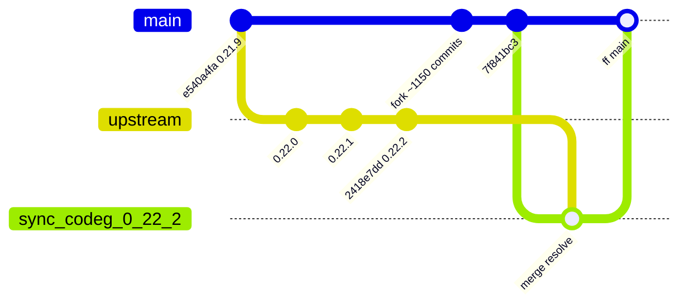
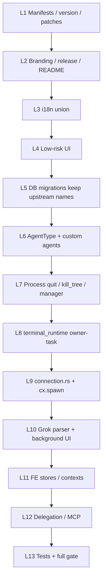
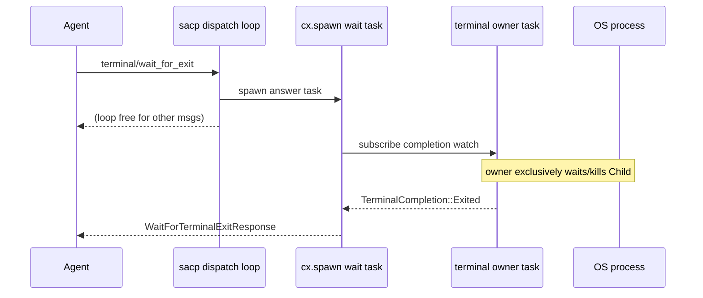
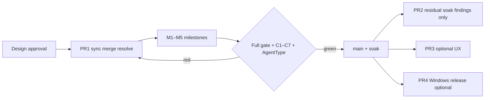

# Upstream 0.22.2 Sync Design

| Field | Value |
| --- | --- |
| **Title** | Latest upstream Codeg merge into MyCodeBuddy (0.22.2) |
| **Author** | TBD (implementing engineer) |
| **Date** | 2026-07-31 |
| **Status** | Draft (revision 2 — Design review r1: keep upstream migration names; resume worktree; inventories; C5/C6) |
| **Target** | `upstream/main` @ `2418e7dd` (# Release version 0.22.2) |
| **Local tip (design base)** | `main` @ `3792bb1c` (was `7f841bc3` at first draft; eight intervening commits before sync start) |
| **Merge-base** | `e540a4fa` (# Release version 0.21.9) |
| **Active worktree** | `D:\MyCodeBuddy-worktrees\sync-codeg-0.22.2` on branch `sync/codeg-0.22.2` |

Related:

- [Upstream synchronization policy](../../UPSTREAM_SYNC.md)
- Prior successful sync: [2026-07-26-upstream-0.21.9-sync-design.md](./2026-07-26-upstream-0.21.9-sync-design.md)
- Prior plan: [2026-07-26-upstream-0.21.9-sync.md](../plans/2026-07-26-upstream-0.21.9-sync.md)
- Fork terminal cancel work: designs under `docs/superpowers/specs/2026-07-14-*`, `2026-07-15-acp-terminal-*`, plan `2026-07-23-terminal-poll-cancel-deadlock.md`
- Kill-tree cycle guard: [2026-07-26-kill-tree-cycle-guard-design.md](./2026-07-26-kill-tree-cycle-guard-design.md)
- Grok hang root cause (upstream): `8444dcda`, background UI `c778044f`

---

## Overview

Merge upstream Codeg **0.22.2** (`2418e7dd`) into the MyCodeBuddy fork from the
current `main` lineage. Integration happens on a dedicated
`sync/codeg-0.22.2` branch with `--no-ff` so both histories remain ancestors of
the verified result. After the full verification gate, the sync branch lands
on local `main`.

This is a **high-conflict** sync. Since the previous successful base
(`v0.21.9` / `e540a4fa`):

| Metric | Value |
| --- | --- |
| Local-only commits | ~1150 |
| Upstream-only commits | **58** (0.21.9 → 0.22.0 → 0.22.1 → 0.22.2) |
| Paths changed both sides | **125** |
| Actual `CONFLICT` paths (`git merge-tree --write-tree main upstream/main`) | **71** |
| Auto-merged both-side paths (no CONFLICT marker) | **~54** (125 − 71) — **still require three-way review** for high-risk files |
| Upstream paths changed | ~252 |
| Local paths changed | ~953 |

**Critical implementer note:** only **71** of the 125 both-side paths produce
git conflict markers. Content conflicts are **not** expected on “most” both-side
paths. The more dangerous failure mode is **silent auto-merge** of high-risk
files (notably `models/agent.rs`) that leaves a non-compiling or
policy-violating tree. After `git merge`, resolve unmerged paths **and**
three-way-audit the mandatory auto-merged list (see playbooks).

The single most important product outcome of this sync is fixing the **Grok
session hang** when an agent backgrounds a long-running terminal command: take
upstream’s owner-task terminal runtime + `cx.spawn` for `terminal/wait_for_exit`,
then re-verify (and if needed re-port) MyCodeBuddy cancel/UX contracts on that
architecture. Upstream custom ACP agents and process quit hardening also land,
composed around fork-only delegation, tool-execution watchdog, Grok MCP bridge,
and Windows release policy.

---

## Background & Motivation

### Current state

MyCodeBuddy last synced cleanly to upstream **0.21.9**. Since then the fork
accumulated large product surface area:

- Delegation stack (companion, broker, work-unit recovery, authorized recovery,
  workflow graphs)
- Tool-execution watchdog and idle-cancel UX convergence
- Terminal cancel hardening (CancellationToken + try_refresh + bounded release +
  TurnComplete-before-cleanup ordering)
- Grok ACP/MCP bridge, compact slash surfacing, retry reconciliation
- Conversation popout, tab limits, viewer-only delegated children
- Branding, packaging, Windows-only release, updater endpoints
- OpenClaw surface **deleted** from fork `AgentType` and tool schema
- Vendored `kill_tree` cycle guard (`src-tauri/vendor/kill_tree` + Cargo
  `[patch.crates-io]`)

Upstream 0.22.x shipped complementary and overlapping work, notably:

1. **Critical ACP hang fix** (`8444dcda`): sacp’s single dispatch loop awaited
   `terminal/wait_for_exit` inline → entire connection freezes on never-exiting
   commands (Grok backgrounds + wait). Fix: answer via `cx.spawn`; rewrite
   `terminal_runtime.rs` so a per-terminal **owner task** exclusively owns
   `Child`; SIGTERM→SIGKILL escalate; kill report bounded while reaping continues.
2. **Grok background command UI** (`c778044f`): TaskOutput envelope for
   background-task cards; drop injected system-reminder user messages that split
   turns.
3. **Process/quit hardening**: kill agent process trees synchronously on quit;
   quit backstop only targets live trees; ETXTBSY terminal spawn retry.
4. **Custom ACP agents platform** (large): `AgentType::Custom(&'static str)` +
   `crate::intern`, codeg-recorded history, settings forms, system installs,
   version probe cache, skills dirs, delegation targets, tab groups / draft
   restore. (MCP settings later dropped custom-agent server management in
   `6b4231f6` — take final tree state.)
5. Claude agent-acp 0.63.0 live subagent transcripts; Kimi reasoning levels;
   composer reference badges; Windows attachment URI fixes; sidebar local
   session import; README slim + multi-locale; agent version pins.

### Pain points this sync addresses

| Pain | Source |
| --- | --- |
| Grok turn hangs on background terminal + wait | Upstream 0.22.2 fix not yet in fork |
| Inline `wait_for_exit` still blocks dispatch on fork | Local `connection.rs` still answers inline (`_cx` unused) |
| Process trees can survive quit | Upstream kill-tree / backstop work |
| Upstream custom agents missing from fork | Product gap vs Codeg 0.22 |
| Dual evolution of same files | 125 both-side / 71 CONFLICT; silent auto-merges need audit |
| OpenClaw reintroduction via auto-merge residue | Both-side `models/agent.rs` auto-merge risk |

### Why not cherry-pick only the hang fix

Cherry-picking `8444dcda` alone would still leave `connection.rs` /
`terminal_runtime.rs` divergent from subsequent upstream fixups (ETXTBSY,
quit kill, Grok background rendering that depends on connection/parser
changes). The repository policy (`docs/UPSTREAM_SYNC.md`) is ancestry-preserving
merge of the release tip. This design follows that policy.

---

## Goals & Non-Goals

### Goals

1. Bring **every** upstream change from `e540a4fa..2418e7dd` into the fork unless
   it conflicts with an explicit MyCodeBuddy policy or a reviewed replacement.
2. Preserve MyCodeBuddy branding, packaging, updater endpoints, Windows-only
   release policy, **removed OpenClaw surface** (hygiene: no `OpenClaw` /
   `open_claw` residual arms), and functional fork behavior (delegation, tool
   watchdog, Grok MCP bridge, terminal cancel UX contracts).
3. Prefer **upstream owner-task terminal architecture** as the base for
   `terminal_runtime.rs`; re-verify fork cancel contracts on that model.
4. Land `cx.spawn` for `terminal/wait_for_exit` (mandatory hang fix); handler
   must use parameter name `cx` (not `_cx`) and actually spawn.
5. Land Grok background-task rendering (`c778044f`) and process quit kill trees.
6. Land custom agents platform with a **complete composed `AgentType` contract
   in PR1** (not deferred polish): fork builtins (incl. Grok/CodeBuddy, no
   OpenClaw) + upstream `Custom` + intern + FE open type + tool_schema strategy.
7. Preserve fork vendored **`kill_tree` cycle guard** and Cargo `[patch]` while
   adopting upstream quit kill semantics.
8. Publish fork version **`0.22.2-mycodebuddy.1`** consistently across all
   version-bearing files (rely on `pnpm test:release` for full stamp coverage).
9. Leave local `main` at a tested merge commit with no unresolved conflicts.

### Non-Goals

- Rebase or rewrite published MyCodeBuddy history.
- Refactor unrelated fork code while resolving conflicts.
- Implement authorized-recovery / workflow work still in design-only state.
- Push `main`, publish a release, or open a remote PR as part of design approval.
- Delete unrelated branches or worktrees.
- Hand-edit lockfile checksums.
- Defer `AgentType::Custom` / OpenClaw hygiene / C1–C7 terminal contracts to a
  follow-up PR (those are **PR1 exit criteria**).

---

## Proposed Design

### Merge strategy (ancestry-preserving)

Matches `docs/UPSTREAM_SYNC.md` and the 0.21.9 sync.

#### Resume-state preflight (authoritative — do this first)

A merge may already be in progress. **Do not** blindly recreate the branch.

Primary worktree (already created for this sync):

- Path: `D:\MyCodeBuddy-worktrees\sync-codeg-0.22.2`
- Branch: `sync/codeg-0.22.2`
- Expected: `HEAD` = pre-sync main tip (`3792bb1c` or recorded tip),
  `MERGE_HEAD` = `2418e7dd`, merge-base with upstream = `e540a4fa`

```powershell
$wt = "D:\MyCodeBuddy-worktrees\sync-codeg-0.22.2"
git -C $wt rev-parse HEAD MERGE_HEAD
git -C $wt merge-base HEAD MERGE_HEAD   # expect e540a4fa
git -C $wt status -sb
# unmerged count should be 71 when still mid-resolve:
(git -C $wt diff --name-only --diff-filter=U).Count
```

| Condition | Action |
| --- | --- |
| `HEAD` + `MERGE_HEAD=2418e7dd` + merge-base `e540a4fa` match recorded pre-sync tip | **Resume** this worktree index; do **not** `merge --abort` |
| Mismatch (wrong tips, no MERGE_HEAD, dirty unrelated rewrite) | `git merge --abort` only after recording reason; recreate below |
| Worktree missing | Create linked worktree from clean `main` (see fresh start) |

**Note:** `D:\MyCodeBuddy` has `main` checked out. Do **not** run
`git switch main` inside the sync worktree. Land on main from the main
worktree after the sync branch commit exists:

```powershell
# after merge commit on sync branch (in sync worktree):
git -C $wt commit   # completes merge when git ls-files -u is empty + gate green

# handoff / FF in the primary main worktree (separate checkout):
git -C D:\MyCodeBuddy fetch --all
git -C D:\MyCodeBuddy switch main
git -C D:\MyCodeBuddy merge --ff-only sync/codeg-0.22.2
# re-run full verification gate on main
```

#### Fresh start (only if resume preflight fails)

```powershell
git fetch upstream
# in a clean linked worktree (main is busy in D:\MyCodeBuddy):
git -C D:\MyCodeBuddy worktree add -b sync/codeg-0.22.2 D:\MyCodeBuddy-worktrees\sync-codeg-0.22.2 main
git -C D:\MyCodeBuddy-worktrees\sync-codeg-0.22.2 merge --no-ff --no-commit upstream/main
# OR: merge v0.22.2 if tag points at 2418e7dd
# Record pre-sync SHA immediately after branch creation.
```

Rules:

- **No rebase** of published MyCodeBuddy history.
- **Single merge commit** on the sync branch for the upstream integration (no
  partial “resolve commit then merge again” that obscures conflict ownership).
- Intermediate work may **stage** resolved paths and run focused checks; do not
  commit while `git ls-files -u` is non-empty.
- Enable `rerere` if not already (`git config rerere.enabled true`).
- **After merge:** resolve `git diff --diff-filter=U` (unmerged) **and** audit
  the **full** 54-path silent auto-merge inventory (see inventories section).
  Do not treat “no conflict markers” as “reviewed.”



### Version / branding policy

| File | Policy |
| --- | --- |
| `package.json` | `version`: **`0.22.2-mycodebuddy.1`**; keep MyCodeBuddy `name`, `repository`, `homepage`, scripts |
| `src-tauri/Cargo.toml` | `version = "0.22.2-mycodebuddy.1"`; keep fork features (`tauri-runtime`, `server`), bins, **both** `[patch.crates-io]` entries (`sacp-tokio` **and** `kill_tree`), repo/homepage |
| `src-tauri/Cargo.lock` | Regenerate from resolved `Cargo.toml` — never hand-merge checksums |
| `src-tauri/tauri.conf.json` | version `0.22.2-mycodebuddy.1`; keep MyCodeBuddy product/identifier/updater endpoints |
| `pnpm-lock.yaml` | `pnpm install --lockfile-only` after manifest resolve |
| Branding / docs / release | Prefer fork; import upstream product docs only where not brand-conflicting |
| `docs/UPSTREAM_SYNC.md` | Update example branch/version from `sync/codeg-0.21.9` / 0.21.9 to 0.22.2 |
| Other version-bearing surfaces | Covered by existing `pnpm test:release` — do not expand the stamp table ad hoc; fix whatever the script flags |

Run `pnpm test:release` as part of the gate to assert version/runtime URL consistency.

### Layered conflict resolution order

Resolve in this dependency order (do not start ACP core until layers 1–3 are
stable enough to compile manifests):

| Layer | Scope | Rule of thumb |
| --- | ---: | --- |
| **L1** | Manifests & version stamps | Fork branding + `0.22.2-mycodebuddy.1`; import upstream dep bumps; **preserve `kill_tree` + `sacp-tokio` patches** |
| **L2** | Branding, release workflow, README/docs | Fork policy wins; union product notes where helpful; **strip OpenClaw** from any imported upstream README/locale docs |
| **L3** | i18n message files (all locales) | **Union keys**; English is schema source; no dropped fork keys |
| **L4** | Low-risk UI (composer badges, attachment URIs, Kimi settings, sidebar import, status bar update surface) | Prefer compose; take upstream feature files when fork has no counterpart |
| **L5** | DB migrations & entities | **Keep all 4 upstream custom-agent migration original names**; register both stacks; no renumber (see § Migration) |
| **L6** | **AgentType / models / custom agents platform** | Composed contract (playbook §0 + §5); force-review auto-merged `models/agent.rs` |
| **L7** | Process quit / kill trees / manager disconnect_all / sacp-tokio vendor | Prefer upstream kill semantics; **preserve vendored kill_tree cycle guard** |
| **L8** | **`terminal_runtime.rs` (HIGHEST RISK)** | **Upstream owner-task base** + fork spawn/adapter algorithm + C1–C7 tests green |
| **L9** | **`connection.rs`** | Fork structure; **must** take `cx.spawn` wait_for_exit; import custom-agent hooks carefully |
| **L10** | Parsers (`grok.rs`) + background-task frontend | Take upstream TaskOutput / reminder skip; keep fork Grok extras |
| **L11** | Frontend stores/contexts (ACP, runtime, tabs) | Compose; no silent whole-file ours |
| **L12** | Delegation / companion / codeg-mcp / tool_schema | Fork wins tool contracts; no `open_claw`; custom advertise strategy per §0 |
| **L13** | Tests & snapshots | Union; review any insta changes |

**Intermediate compile milestones** (stage work; do not merge while red):

| Milestone | After layer | Check |
| --- | --- | --- |
| M1 | L1–L5 | `cargo check` (manifests, patches, migrations compile) |
| M2 | L6–L7 | `cargo check` + OpenClaw hygiene + kill_tree patch gate |
| M3 | L8–L9 | `cargo test --features test-utils terminal_runtime` / wait_for_exit / release_ + C1–C7 green |
| M4 | L10–L12 | Grok + FE vitest + codeg-mcp check |
| M5 | L13 | Full verification gate |



---

## Explicit resolution playbooks

### 0. `models/agent.rs` + `AgentType` composition (CRITICAL — silent auto-merge)

**Why this is first:** On current tips, `src-tauri/src/models/agent.rs` is
**both-side changed but auto-merges without a CONFLICT marker**. Inspecting the
merge-tree result:

- `enum AgentType` has **no** `OpenClaw` variant (fork deletion wins on the enum
  body) and **does** gain upstream `Custom(&'static str)`.
- `BUILTIN_AGENT_TYPES`, `as_wire`, `from_wire`, and tests still reference
  `AgentType::OpenClaw` / `"open_claw"`.
- Result: a “successful” auto-merge that **cannot compile** and would violate
  OpenClaw-deletion policy if naively “fixed” by restoring the variant.

Fork today (`main`): closed serde `snake_case` enum, **no** `Custom`, **no**
`OpenClaw`, **no** `intern.rs`. Upstream: twelve builtins including OpenClaw +
`Custom` + `CUSTOM_AGENT_WIRE_PREFIX` + interned slug.

#### Target composed shape (PR1 mandatory)

| Piece | Policy |
| --- | --- |
| Builtins | **MyCodeBuddy set**: ClaudeCode, Codex, OpenCode, Gemini, Cline, Hermes, CodeBuddy, KimiCode, Pi, Grok, Cursor — **no OpenClaw** |
| Custom | **Take upstream** `AgentType::Custom(&'static str)` + `CUSTOM_AGENT_WIRE_PREFIX` (`custom:`) + `is_valid_custom_agent_id` + `crate::intern` |
| Wire form | Builtins: historical snake_case (`grok`, `code_buddy`, …). Customs: `custom:<slug>` (e.g. `custom:goose`) |
| Serde | Upstream-style `as_wire` / `from_wire` (or equivalent) that stays `Copy` via intern |
| OpenClaw | **Strip every residual** arm, test, and string — never reintroduce the variant |
| FE `src/lib/types.ts` | Adopt open type: `BuiltinAgentType` union + `AgentType = BuiltinAgentType \| (string & {})` (or equivalent). **Cannot** keep `Record<AgentType, string>` if `AgentType` becomes open — use `Partial<Record<BuiltinAgentType, …>>` / maps for builtins only + fallback label for customs |
| `AGENT_LABELS` / `ALL_AGENT_TYPES` / `AGENT_DISPLAY_ORDER` | Builtins only; customs resolved from registry at runtime |
| New module | Land upstream `src-tauri/src/intern.rs` (or equivalent path) |

#### `tool_schema.json` / companion strategy (PR1)

Fork `tool_schema.json` uses a **closed** `agent_type` enum (no `custom:*`);
upstream schema may still list `open_claw` and lacks fork fields
(`correlation_id`, `profile_id`, workflows, etc.).

| Decision | Detail |
| --- | --- |
| Tool surface | **Fork wins** — keep all fork tools and required fields |
| `open_claw` | **Never** reintroduce in enum or descriptions |
| Customs as `delegate_to_agent` targets in PR1 | **Do not advertise** customs in the closed MCP `agent_type` enum for PR1. Custom agents remain usable via settings/session connect; companion may list them for UI/target filters separately if upstream hooks land cleanly |
| Future (PR3 optional) | Dynamic schema / free-string + validation for `custom:*` if product wants customs as delegation targets |

Rationale: changing exhaustive match surfaces (~hundreds of `AgentType`
references in `connection.rs`, `broker.rs`, `manager.rs`) is already PR1 work;
opening MCP enum without validation invites invalid targets mid-sync.

#### Resolution steps

1. **Force three-way review** of `models/agent.rs` even when git reports clean
   auto-merge (`git show :2:…` / `:3:…` or `merge-base` vs ours vs theirs).
2. Hand-compose target shape above; strip OpenClaw arms from auto-merge residue.
3. Land `intern.rs`; fix all exhaustive matches for `Custom` (usually a
   registry lookup / display-name fallback arm).
4. Update FE types and any `Record<AgentType, …>` maps.
5. Keep fork tool_schema closed enum (no `open_claw`, no `custom:*` in PR1).
6. Hygiene gate (must be empty of residual identifiers):

```powershell
rg -n "OpenClaw|open_claw" src-tauri/src src src-tauri/src/acp/delegation
# Expected: no matches (except intentional historical comments if any — prefer zero)
```

#### Required tests (PR1)

- Serde / wire round-trip `custom:goose` (and reject invalid slugs).
- Builtins unchanged wire names (`grok`, `code_buddy`, …).
- `open_claw` / `OpenClaw` **rejected** / absent.
- Registry list includes **enabled** customs beside Grok/Codex/Claude.
- FE type maps compile (no `Record<AgentType, …>` over open type).

#### Dependencies

L6 depends on L1 (if intern is a module path in `lib.rs` / `mod.rs`) and
blocks L7–L12 match compilation. List in Appendix B.

---

### 1. `src-tauri/src/acp/terminal_runtime.rs` (HIGHEST RISK)

#### Divergent models

| Aspect | Fork (`main`) | Upstream 0.22.2 |
| --- | --- | --- |
| Child ownership | `Mutex<Option<Child>>` on instance | **Owner task** exclusively holds `Child` |
| Cancel signal | `CancellationToken` | `Notify` kill signal to owner |
| Completion | `watch::Sender<Option<TerminalExitStatus>>` | `watch::Sender<TerminalCompletion>` (`Running` \| `Exited`) |
| Kill escalate | fork kill_tree + bounds | SIGTERM → grace → SIGKILL; survivor sweep |
| Report bounds | `RELEASE_KILL_BOUND` 3s, `EXIT_STATUS_WAIT_BOUND` 10s | `KILL_REPORT_BUDGET` 5s (report only; owner continues) |
| Spawn model | `ExecutionMode`, `AcpTerminalAdapter`, shell wrap, structured spawn errors | Simpler create path + ETXTBSY retry via `process::spawn_retrying_exec_busy` |
| Size | ~1713 lines | ~1589 lines (full rewrite in `8444dcda`) |

#### Decision (agreed)

**Prefer upstream owner-task architecture as the merge base.** Do **not** try
to keep the mutex+token model and bolt hang fixes onto it — the hang root cause
is architectural (dispatch-loop await + child mutex held across wait).

Then re-apply fork **behavioral contracts** as regression tests / small ports.

**Do not “unify” owner task onto `cx.spawn`.** Owner task remains
`tokio::spawn(own_terminal_process)` (process-owned lifetime). Connection hang
fix uses `cx.spawn` only for answering `wait_for_exit`. Mixing these ties
process lifetime to connection scope incorrectly.

**Windows kill note:** Prefer upstream escalate **where applicable** (POSIX
SIGTERM→SIGKILL). On Windows, signal model differs — keep **`kill_tree` tree
kill** (vendored cycle-safe crate) for process-tree kill and remaining survivors
after escalate attempts. Do not assume POSIX signals alone suffice on Windows.

#### Fork contract matrix (must be green in PR1)

| ID | Contract | Fork evidence | Expected on owner-task |
| --- | --- | --- | --- |
| C1 | Concurrent `wait_for_exit` does not block `terminal/output` / delta | `terminal_output_delta_does_not_block_behind_wait_for_exit` | Natural if owner holds Child and snapshot is lock-free for readers |
| C2 | Cancel/kill not gated on full process death latency for **report** | `RELEASE_KILL_BOUND`, kill report budget | Map to upstream `KILL_REPORT_BUDGET`; owner keeps reaping |
| C3 | Session `release_all` completes promptly under concurrent wait | `concurrent_wait_and_session_release_completes_promptly` | Upstream concurrent session teardown; port test |
| C4 | Release timeout does not cancel exit-status publication | `release_timeout_does_not_cancel_exit_publication` | Owner task continues past report budget; port test |
| C5 | TurnComplete-before-cleanup ordering (user stop / cancel UX) | connection + lifecycle | **Enforced** — see C5 acceptance below (not a soft re-check) |
| C6 | Shell / adapter spawn modes (`ExecutionMode`, structured spawn errors) | fork `terminal_adapter` + `TerminalRuntime` | **Port** real fork call sequence into owner-task base — see C6 below |
| C7 | Reader drain grace before publishing exit | both | Keep `READER_DRAIN_GRACE`; register readers **before** owner-task spawn |

**PR1 exit criterion:** C1–C7 tests green (ported or still green after rewrite).
PR2 is **only** for residual edge cases discovered **post-soak**, not a dumping
ground for skipping the matrix. Expect real rewrite cost: CancellationToken-based
tests must be rewritten against Notify/owner APIs — budget that in PR1, not
defer casually.

#### C5 — TurnComplete-before-cleanup acceptance (enforceable)

Fork ordered cancel contract (must survive connection + runtime merge):

1. Notify agent of stop/cancel.
2. Emit `TurnComplete(cancelled)` (user stop) **before** bounded terminal release.
3. Clear tracked tools / resolve pending permissions.
4. Begin bounded terminal release / kill report budget.
5. Cascade delegation cleanup after TurnComplete is observable.

Additional rules:

- **Idle cancel** → `Connected` with **no** synthetic TurnComplete.
- **Watchdog cancel** → must **not** claim `user_stop`.
- Named regressions required in PR1 gate (port or add if missing):
  - active user cancel: TurnComplete observable before release teardown
  - watchdog cancel classification ≠ user_stop
  - idle cancel convergence (Connected, no synthetic TurnComplete)
  - pending permission clear on cancel
  - TurnComplete-before-release boundary under concurrent `wait_for_exit`

Manual Grok Stop smoke (Observability) is **additional**, not a substitute for
the named backend regressions. Rollout steps 5–6 must list C5 tests green
before FF-to-main.

#### C6 — concrete adapter port algorithm (API-accurate)

**Do not** invent `adapter.resolve_spawn` or pass `agent_type` into
`create_terminal`. Live fork API (main tip):

- `adapter_for(agent_type) -> &'static dyn AcpTerminalAdapter` constructs the
  runtime **once** (call site outside create).
- `TerminalRuntime::create_terminal(&self, request)` already holds `self.adapter`.
- Sequence inside create:

```text
create_terminal(request)  // on TerminalRuntime with adapter already bound
  1. request = self.adapter.normalize_terminal_request(request)?
  2. validate absolute cwd (if present), non-empty command, output_byte_limit > 0
  3. mode = self.classify_request(&request)?   // DirectProgram | ShellCommandLine
  4. build tokio Command from mode + configure_command
  5. child = command.spawn()
       map_err -> TerminalRuntimeError::Spawn {
            code: "terminal_program_spawn_failed" | "terminal_shell_spawn_failed",
            executable, display_name, mode, os_error
          }
       // structured Spawn codes are **mandatory** (FE/diag consumers exist)
  6. take stdout/stderr; register reader drain handles **before** owner task
  7. spawn owner task: tokio::spawn(own_terminal_process(...))  // upstream shape
  8. return CreateTerminalResponse + completion watch (upstream shape)
```

Upstream ETXTBSY retry (`spawn_retrying_exec_busy` or equivalent) wraps the
spawn step when porting owner-task base. Reader handles **must** be live before
owner task can publish completion (instant-exit race).

Windows-only tests that must stay green (or be ported with equivalent names):

- Adapter/shell classification for Grok / CodeBuddy / Claude wrap paths
- Structured spawn error codes (`terminal_*_spawn_failed`)
- Any `#[cfg(windows)]` spawn normalization tests in adapter / process helpers

#### Resolution steps

1. Take **upstream file** as structural base (owner task, `TerminalCompletion`,
   escalate kill, `send_replace`).
2. Port C6 algorithm (adapter resolve → `spawn_retrying_exec_busy` → owner task).
3. On Windows kill path: escalate where applicable + **kill_tree** for tree /
   survivors (vendored cycle guard).
4. Port **both** test suites: upstream owner-task tests + fork cancel/release
   tests rewritten against Notify/owner APIs — all C1–C7 green in PR1.
5. Do **not** reintroduce `Mutex<Option<Child>>` for the wait path.
6. Do **not** move owner task onto `cx.spawn`.



---

### 2. `src-tauri/src/acp/connection.rs` — `wait_for_exit` handler

**Mandatory patch shape** (from `8444dcda`), regardless of surrounding conflict
noise. Current fork still answers inline with `_cx` unused:

```rust
// FORK TODAY (hangs Grok) — DO NOT KEEP
async move |req, responder, _cx| {
    respond_terminal_request(responder, runtime.wait_for_terminal_exit(req).await)?;
    Ok(())
}
```

**Required result:**

```rust
async move |req: WaitForTerminalExitRequest,
            responder: Responder<WaitForTerminalExitResponse>,
            cx: ConnectionTo<Agent>| {
    let runtime = runtime.clone();
    cx.spawn(async move {
        let result = runtime.wait_for_terminal_exit(req).await;
        if let Err(err) = respond_terminal_request(responder, result) {
            tracing::warn!("[ACP] failed to answer terminal/wait_for_exit: {err}");
        }
        Ok(())
    })?;
    Ok(())
}
```

Rules:

- Use `cx.spawn` (connection-scoped), **not** bare `tokio::spawn`.
- Parameter must be named **`cx`** and used — **not** `_cx`.
- After resolve, the wait_for_exit handler must not await
  `wait_for_terminal_exit` on the dispatch path.

#### Rest of `connection.rs` (~19.6k fork vs ~10.3k upstream)

This file is the densest conflict surface. Policy:

| Concern | Prefer |
| --- | --- |
| `cx.spawn` wait_for_exit | **Upstream (mandatory)** |
| Custom agent session / history hooks | Upstream additions composed into fork connection bootstrap |
| Grok MCP bridge, user-stop TurnComplete, continuation, watchdog host | **Fork** |
| Process kill on disconnect/quit hooks | Upstream + preserve cycle-safe kill_tree usage |
| Terminal create env / PATH helpers | Compose; keep fork Windows/shell behavior |
| Background-task / reminder filtering hooks from `c778044f` | **Upstream** |
| Grok reminder-skip wiring | Must survive conflict resolution (do not drop with “prefer fork” noise) |

**Resolution technique:** three-way review (`merge-base`, `ours`, `theirs`) per
hunk. Never `git checkout --ours` the whole file. After resolve, assert:

- `cx.spawn` on the **wait_for_exit** path specifically (not merely somewhere)
- no second inline `wait_for_terminal_exit(req).await` in that request handler
- wait_for_exit handler parameter is `cx`, not `_cx`
- fork symbols for watchdog / delegation still compile

---

### 3. Grok parser + background-task frontend

Upstream `c778044f` touches:

- `src-tauri/src/parsers/grok.rs`
- `src-tauri/src/acp/connection.rs` (related)
- `src/lib/background-task.ts` (+ tests)
- `src/lib/tool-call-normalization.ts` (+ tests)
- `src/components/message/background-task-card.test.tsx`

**Policy:**

| Piece | Action |
| --- | --- |
| TaskOutput envelope / background-task cards | **Take upstream** |
| Skip Grok injected system-reminder user messages | **Take upstream** |
| Fork-only Grok behaviors (compact slash, retry stream, MCP bridge parsing extras) | **Keep** if present in fork `grok.rs` |
| Codex search-result unwrap (`0a869c32`) | **Take upstream** if both sides touch related normalization |

Fork `grok.rs` is larger (~2005 vs ~1725 lines). Merge by importing upstream
background-task / reminder logic into the fork parser structure rather than
dropping fork parser extensions.

**Note:** local already has `background-task-card` components; fork
`background-task.ts` is more Claude-centric today. Upstream changes that path
since merge-base may auto-take cleanly — still **union FE tests** and ensure
connection/parser hooks for reminder skipping are not dropped when resolving
huge `connection.rs` / `grok.rs` conflicts.

#### L10 checklist

After L10:

```powershell
pnpm exec vitest run src/lib/background-task.test.ts src/lib/tool-call-normalization.test.ts
# Assert Grok-specific helpers exist (name may vary slightly):
rg -n "parseGrokTaskOutput|TaskOutput|system-reminder|system_reminder" src/lib/background-task.ts src-tauri/src/parsers/grok.rs
```

---

### 4. Process quit kill trees + vendored kill_tree cycle guard

Upstream commits: `5fe6e7a9`, `39986308`, related PR `4bacba9e`, plus vendor
`sacp-tokio` changes.

**Cycle guard location (verified — not in `process.rs`):**

- Cycle guard lives in **`src-tauri/vendor/kill_tree`** (`visited: HashSet` in
  `common.rs`), per approved design
  `2026-07-26-kill-tree-cycle-guard-design.md`.
- Fork `Cargo.toml` `[patch.crates-io]` has **both**:
  - `sacp-tokio = { path = "vendor/sacp-tokio" }`
  - `kill_tree = { path = "vendor/kill_tree" }`
- Upstream only patches `sacp-tokio`. Auto-merged `Cargo.toml` currently keeps
  the fork `kill_tree` patch — **must not drop it** during L1.

Without the vendored cycle fix, Windows cyclic parent graphs can OOM again under
upstream’s more aggressive quit backstop (which **depends on** `kill_tree`).

**Policy:**

- Land synchronous kill of agent process trees on quit.
- Land quit backstop that only kills **live** agent trees (avoid collateral).
- **Preserve fork vendored `kill_tree` cycle guard and `[patch.crates-io]
  kill_tree`.** Re-diff `vendor/sacp-tokio` against upstream vendor and re-apply
  any fork-only patches.
- ETXTBSY spawn retry (`21ef9c37`) lands with process/terminal create
  (`spawn_retrying_exec_busy`).
- Do **not** look only in `process.rs` / `manager.rs` for “cycle guard” — the
  protection is the vendored crate + patch.

**L1 checklist items:**

```powershell
# Patch present
rg -n "kill_tree = \{ path = \"vendor/kill_tree\" \}" src-tauri/Cargo.toml
rg -n "sacp-tokio = \{ path = \"vendor/sacp-tokio\" \}" src-tauri/Cargo.toml
# Cycle guard still in vendor
rg -n "visited" src-tauri/vendor/kill_tree
```

---

### 4b. `manager.rs` — `disconnect_all` quit backstop (L7 mini-playbook)

Upstream `disconnect_all` adds `DISCONNECT_ALL_GRACE` + live-pid kill_tree
backstop with tests. Fork `disconnect_all` only sends `Disconnect` and returns
(verified on `main` ~line 4807). This is a **both-side CONFLICT** and is
product-critical for “no orphan agent tree.”

| Concern | Prefer |
| --- | --- |
| `disconnect_all` structure | **Upstream** live-tree kill backstop + grace |
| Connection ownership / watchdog fencing | **Fork** — preserve ownership generation / fences |
| Tests | Run upstream backstop tests **and** fork manager tests together |

Do not whole-file ours/theirs. Compose: take upstream kill backstop body;
re-insert fork ownership/watchdog paths where they diverge.

---

### 5. Custom agents vs fork agent registry / delegation

Upstream introduces a full platform (non-exhaustive):

- `src-tauri/src/acp/custom_registry.rs` (fork lacks this module today)
- `src-tauri/src/commands/custom_agents.rs`, `custom_skills.rs`
- DB entities + **4** migrations (see migration identity policy)
- FE: add-custom-agent dialog, settings, skills toggle, agent icon paths
- Delegation: custom agents as targets; advertise only **enabled** agents
  (`ec111f30`)
- `AgentType::Custom` + `intern` — see **playbook §0** (PR1 mandatory)

Fork already has:

- Extended `registry.rs`, bundled agents, Grok, CodeBuddy profiles
- Delegation companion / tool_schema / broker (far ahead of upstream)
- MCP settings for fork needs; upstream later **dropped** custom-agent server
  management from MCP settings (`6b4231f6`) — **take final upstream tree**, do
  not resurrect dropped UI unless fork explicitly needs it

#### Migration identity policy (CRITICAL — revision 2)

**Decision (Design review DR-C1 + user):** **Keep all four upstream custom-agent
migration original names.** Do **not** renumber to `m20260731_*`.

SeaORM `#[derive(DeriveMigrationName)]` uses the **full file stem**
(`get_file_stem(file!())`), not the date prefix alone. Therefore:

| Upstream stem (keep) | Fork stem same date prefix | Collision? |
| --- | --- | --- |
| `m20260726_000001_custom_agent` | `m20260726_000001_delegation_workflows` | **No** — distinct Rust modules + distinct SeaORM identities |
| `m20260727_000001_custom_agent_skills` | `m20260727_000001_workflow_structural_revision` | **No** |
| `m20260728_000001_custom_agent_skills_dir` | (none) | N/A |
| `m20260728_000002_custom_agent_source` | (none) | N/A |

Earlier design text that labeled these as **COLLIDES** was **incorrect**. Same
timestamp prefix is not a module-path collision when the full stem differs.

**Supported DB lineage:** MyCodeBuddy **fork** databases only (users who have
been applying MyCodeBuddy migrations). Pure upstream 0.22.x databases that
already recorded the same upstream stem names are **out of scope** for this
sync (would already match identity if someone later dual-boots — not a renumber
problem).

Rules:

1. Keep all **existing** MyCodeBuddy migrations at current version ids. **Never**
   renumber shipped fork migrations.
2. **Keep** upstream four custom-agent migration filenames and SeaORM names as
   shipped by 0.22.2.
3. Register both stacks in `src-tauri/src/db/migration/mod.rs` in a stable order
   (fork modules stay; add upstream modules; chronological by stem is fine —
   independent tables).
4. Do **not** rewrite durable migration identities solely for “pretty” ordering.
5. Automated fixtures (PR1 gate):
   - **Fresh empty DB:** full chain applies; custom-agent tables present.
   - **Pre-sync fork DB** (has `delegation_workflows` / workflow_manifest_v2):
     only the four new custom-agent migrations apply; no fork migrations re-run.
6. Optional smoke: open app once on each fixture class.

Gate (revision 2):

```powershell
# original upstream stems MUST be present (not renumbered away)
rg -n "m20260726_000001_custom_agent|m20260727_000001_custom_agent_skills|m20260728_000001_custom_agent_skills_dir|m20260728_000002_custom_agent_source" src-tauri/src/db/migration
# m20260731 renumber paths must NOT appear
rg -n "m20260731_00000[1-4]_custom_agent" src-tauri/src/db
# must be empty
```

#### Integration (PR1 — not optional polish)

1. Land custom agent modules and FE as upstream (settings, skills, icons).
2. Wire **composed `AgentType`** per §0 (Custom + no OpenClaw + FE open type).
3. Wire registry enumeration so custom agents appear beside built-ins without
   breaking Grok/Codex/Claude resolution; **enabled-only** advertising where
   upstream does that.
4. **Desktop/Web parity matrix (mandatory):** for each of list / save / delete /
   catalog / add / platform (or upstream’s six Tauri commands + matching Axum
   routes): register Tauri command **and** `web/handlers/acp.rs` + `web/router.rs`
   + `src/lib/api.ts` transport. Gate with both-runtime tests or explicit
   dual-path checks — a compiling `AgentType` alone is not enough.
5. Delegation tool schema: **fork tool contracts win**; customs **not** in
   closed MCP enum for PR1 (see §0).
6. Skills directories: land upstream; ensure codeg-mcp / companion skills paths
   remain valid.
7. PR3 may polish UX / optional custom-as-delegation-target advertising only.

---

### 6. Frontend stores / tabs / contexts

Both sides touched:

- `src/contexts/acp-connections-context.tsx` (+ tests)
- `src/stores/conversation-runtime-store.ts`
- `src/contexts/tab-context.tsx`, `src/stores/tab-store.ts`
- Tab bar / tab groups (upstream unlimited tab groups + draft restore)
- Chat input / composer / settings

**Policy:** compose. Upstream tab groups and draft restore are product features
to keep; fork popout / MRU tab limit / viewer-only delegated children stay.
Single global ACP event listener fix (`d8c4301a`) should land.

---

### 7. Lockfiles, i18n, docs

- **Lockfiles:** resolve manifests first; regenerate.
- **i18n:** union keys across all 10 locales; missing translations may copy
  English temporarily but must not drop keys.
- **README / docs/readme/\***: MyCodeBuddy branding first; import upstream feature
  blurbs (custom agents, split view) into fork voice if desired.
- **OpenClaw:** keep deleted; hygiene gate must stay green (see §0).

---

### 8. `codeg-mcp` / companion / tool_schema

Both trees have `src-tauri/src/bin/codeg_mcp.rs`. Fork has substantially more
delegation tool surface. Resolve by **preserving fork companion tool contracts**;
import upstream changes only when they are mechanical or required for custom
agent UI/session advertising. Do not let upstream shrink tool schema silently.
Never reintroduce `open_claw`. Import upstream `get_session_info` only if fork
lacks an equivalent.

---

### 9. Expanded high-risk path preferences (mandatory three-way audit)

Even when git auto-merges, three-way review these both-side paths:

| Path | Prefer / action |
| --- | --- |
| `src-tauri/src/models/agent.rs` | **Force review** — composed shape §0; strip OpenClaw residue |
| `src-tauri/src/intern.rs` (new upstream) | Land wholesale |
| `src/lib/types.ts` | Open `AgentType` + builtin-only maps §0 |
| `src-tauri/src/acp/manager.rs` | Upstream `disconnect_all` backstop + fork ownership/watchdog fences |
| `src-tauri/src/process.rs` | **Union:** ETXTBSY `spawn_retrying_exec_busy` + fork `ensure_node_in_path` / Windows program normalization |
| `src-tauri/src/acp/registry.rs` | Fork Grok/CodeBuddy pins + upstream custom-agent enumeration hooks |
| `src-tauri/src/acp/lifecycle.rs` | Compose; no whole-file either side |
| `src-tauri/src/acp/session_state.rs` | Compose; no whole-file either side |
| `src-tauri/src/acp/event_stream.rs` | Compose |
| `src-tauri/src/acp/types.rs` | Compose |
| `src-tauri/src/app_state.rs` | Compose |
| `src-tauri/src/acp/delegation/tool_schema.json` | **Fork wins** tool contracts; no `open_claw`; no PR1 custom enum expansion |
| `src-tauri/src/acp/delegation/companion.rs` | Fork tools; import enabled-only target filter if compatible |
| `src-tauri/src/bin/codeg_mcp.rs` | Fork companion contracts |
| `src-tauri/src/commands/acp.rs` | Compose |
| `src-tauri/Cargo.toml` | Keep **both** patches; version stamp; fork features/bins |
| `src-tauri/vendor/kill_tree/**` | **Keep fork cycle guard**; do not accept upstream crates.io kill_tree |
| `src-tauri/vendor/sacp-tokio/**` | Prefer upstream vendor; re-apply fork-only patches if any |
| `src-tauri/src/acp/terminal_runtime.rs` | Playbook §1 |
| `src-tauri/src/acp/connection.rs` | Playbook §2 |
| `src-tauri/src/parsers/grok.rs` | Playbook §3 |

After `git merge --no-commit`:

```powershell
git diff --diff-filter=U --name-only          # unmerged (71 expected scale)
# Also review auto-merged both-side high-risk list above — not only unmerged.
# Optional: capture authoritative conflict list into plan doc at execution time:
#   git merge-tree --write-tree main upstream/main  (or ls-files -u during merge)
```

---

## API / Interface Changes

No new public HTTP routes are the focus of this sync; most changes are internal
ACP and agent registry surfaces. Expected interface deltas to absorb:

| Surface | Change | Consumer impact |
| --- | --- | --- |
| ACP `terminal/wait_for_exit` host handling | Non-blocking via `cx.spawn` | Fixes hang; no wire protocol change |
| Terminal runtime internals | Owner task API | Internal only; tests rewrite |
| `AgentType` | Composed: fork builtins (no OpenClaw) + `Custom(&'static str)` + intern | Exhaustive matches need `Custom` arms; FE open type |
| Wire / storage | Builtins snake_case; customs `custom:<id>` | DB columns remain string-compatible |
| Custom agents CRUD / settings | New commands + DB | New settings UI; opt-in for users |
| Delegation targets (MCP schema) | PR1: **builtins only** in closed enum | Customs not advertised via `delegate_to_agent` in PR1 |
| Background task message parts | TaskOutput envelope | FE cards; normalize in adapters |
| Agent version pins | Bumped in registry | Install/upgrade paths |

TypeScript mirrors in `src/lib/types.ts` and API clients must stay aligned with
Rust models after resolve.

---

## Data Model Changes

### Upstream custom agent tables

Land entities:

- `custom_agent` (+ skills, skills_dir, source provenance columns across migrations)

### Migration strategy

1. Keep all **existing** MyCodeBuddy migrations at their current version ids
   (users already applied them). **Never** renumber shipped fork migrations.
2. **Keep** all four upstream custom-agent migration original stems (see
   playbook §5 migration identity policy). Do **not** renumber to
   `m20260731_*`. Full stems differ from fork modules — no SeaORM/module
   collision.
3. Register both stacks in `src-tauri/src/db/migration/mod.rs`.
4. On fresh DB: full chain applies. On existing fork DB: only new custom-agent
   migrations run.
5. Automated fixtures: fresh empty DB + pre-sync fork DB (has
   `delegation_workflows` / workflow_manifest_v2).
6. Gate: original upstream stems present; no `m20260731_00000*_custom_agent`
   renumber paths.

No data backfill required for custom agents (empty by default).

---

## Alternatives Considered

### A. Dedicated sync branch + `--no-ff` merge (selected)

Matches `UPSTREAM_SYNC.md` and 0.21.9 practice. Isolates conflict state,
preserves ancestry, allows verification before advancing `main`.

### B. Cherry-pick only hang-related commits (`8444dcda`, `c778044f`)

Faster short-term, but leaves process kill, custom agents, ETXTBSY, tab groups,
and dependency pins behind; increases future merge pain; obscures upstream
ancestry. **Rejected** as primary strategy. Cherry-picks remain emergency
rollback options only.

### C. Prefer fork `terminal_runtime` and only add `cx.spawn`

Would free the dispatch loop but **leave** child-mutex contention: cancel,
output, and kill can still stall behind a long `wait()`. Upstream rewrite exists
specifically for that second failure mode. **Rejected.**

### D. Resolve conflicts directly on `main`

Exposes `main` to a multi-day conflicted index; harder rollback. **Rejected.**

### E. Wholesale `ours` on `connection.rs` / `terminal_runtime.rs`

Fast but drops hang fix and custom-agent hooks. Violates sync policy. **Rejected.**

### F. Defer Custom/`AgentType` composition to PR3

Would leave PR1 non-compiling or with OpenClaw residue / closed FE maps broken.
**Rejected** — composed contract is a PR1 exit criterion; PR3 is UX-only.

---

## Security & Privacy Considerations

| Topic | Notes |
| --- | --- |
| Process kill on quit | Prefer precise live-tree kill (upstream backstop); avoid killing unrelated user processes |
| PID reuse | Owner-task model signals only while Child is unreaped — safer than stale pids |
| kill_tree cycles | Vendored cycle guard prevents OOM on cyclic Windows process graphs under aggressive quit |
| Custom agent binaries | User-supplied executables; keep existing preflight / path validation patterns; do not log secrets from env or command lines (fork spawn error policy) |
| MCP / codeg-mcp | Preserve fork tool description compression and stdio write hardening; do not weaken auth on server mode |
| Updater endpoints | Keep MyCodeBuddy endpoints; never point production builds at upstream Codeg update URLs |
| Attachment URIs | Land Windows verbatim path fixes to avoid path smuggling / broken uploads |

Threat model for this sync is primarily **integrity of the merge** (not
introducing regressions that leave orphan agent processes or hang connections
indefinitely).

---

## Observability

| Signal | Where |
| --- | --- |
| `tracing` warn on failed wait_for_exit respond | connection handler (upstream) |
| Terminal cleanup timeout logs | runtime release path |
| Quit kill / backstop diagnostics | manager / process (upstream disconnect_all) |
| Tool-execution-watchdog (fork) | keep metrics/events — orthogonal safety net |
| Frontend hang indicators | idle-cancel / parent waiting banner (fork UI) |

After sync, verify in a manual Grok session:

1. Start a long `sleep` / dev server via agent terminal tools.
2. Confirm UI still streams other updates (connection not frozen).
3. Cancel turn; confirm Stop UX and TurnComplete ordering.
4. **Quit app mid-command; confirm no orphan agent tree (Task Manager)** —
   required success criterion, not optional.

---

## Risk Matrix

| Risk | Severity | Likelihood | Mitigation |
| --- | --- | --- | --- |
| terminal_runtime semantic loss of cancel UX | **Critical** | Medium | Upstream base + C1–C7 green in PR1; Windows kill_tree note |
| Miss `cx.spawn` / leave `_cx` during connection merge | **Critical** | Medium | Explicit path-scoped grep; handler must use `cx` |
| Silent auto-merge of `models/agent.rs` (OpenClaw residue / non-compile) | **Critical** | **High** | Force three-way review; OpenClaw hygiene gate; composed shape §0 |
| Exhaustive-match / FE map breakage from `Custom` | **Critical** | High | PR1 AgentType contract; open FE type; Custom arms everywhere |
| Migration id rewrite breaks durable SeaORM history | **Critical** | High if renumbered carelessly | Keep upstream original stems (distinct from fork); never rewrite applied fork ids; fixtures for fresh + pre-sync fork DB |
| Drop `kill_tree` Cargo patch during L1 | **Critical** | Medium | L1 checklist; vendor `visited` gate; K8 rewrite |
| connection.rs silent ours drops fork delegation | **Critical** | Medium | No whole-file ours; compile codeg-mcp + desktop tests |
| Custom agents break built-in registry | High | Medium | Integration tests for agent list + connect paths |
| Tool watchdog conflicts with new terminal model | Medium | Low–Med | Keep watchdog; retest stalled tool cancel |
| i18n key skew | Medium | High | Union + schema check vs `en.json` |
| Lockfile / dep skew | Medium | Medium | Manifest-first; regenerate locks |
| sacp-tokio vendor drift | High | Medium | Prefer upstream vendor with fork patches re-applied if any |
| Tab group + fork tab limit fight | Medium | Medium | Compose: groups from upstream, LRU limit from fork |
| Only fixing unmerged paths, missing auto-merge audit | High | High if ignored | Mandatory three-way audit list; 71 CONFLICT vs 125 both-side metrics |
| Timeboxed resolve introduces regressions | High | Medium | Milestones M1–M5 + full gate; no main merge while red |

---

## Rollout Plan

1. **Design approval** (this document).
2. **Implementation plan** (optional sibling under `docs/superpowers/plans/`) with
   checkbox tasks mirroring layers L1–L13 and milestones M1–M5.
3. Create `sync/codeg-0.22.2` from clean `main`; merge `upstream/main` `--no-ff
   --no-commit`.
4. Resolve by layers; run intermediate compile milestones (M1 after L5, M2 after
   L7, M3 after L9, M4 after L12).
5. Full verification gate on sync branch.
6. FF-merge sync branch into local `main`; re-run gate.
7. **Do not** auto-publish release. Release is a separate Windows packaging
   decision after soak.
8. Feature flags: none required for hang fix (should ship on). Custom agents
   are opt-in by user configuration.

Effort expectation: multi-day resolve for ~71 CONFLICT paths + silent auto-merge
audits + AgentType blast radius. Do not rush C1–C7 or AgentType hygiene into PR2.

### Rollback strategy

| Stage | Rollback |
| --- | --- |
| During conflict resolution | `git merge --abort` on sync branch |
| After merge commit on sync, before main | Delete/abandon sync branch; `main` unchanged |
| After FF to local main, before push | `git reset --hard <pre-sync-main-sha>` (local only) |
| After push to origin | Revert merge commit (prefer) or follow emergency cherry-pick of hang-only if release-critical — document if used |

Record pre-sync `main` SHA in the merge commit message body:

```
Merge upstream Codeg 0.22.2 (2418e7dd) into MyCodeBuddy

Pre-sync main: 7f841bc3 (or actual tip at execution time)
Merge-base: e540a4fa
Version: 0.22.2-mycodebuddy.1
```

---

## Verification Gate

Full gate (must pass on sync branch and again on final `main`):

```powershell
pnpm eslint .
pnpm test
pnpm build
pnpm test:release

Set-Location src-tauri
cargo check
cargo test --features test-utils
cargo clippy --all-targets --features test-utils -- -D warnings
cargo check --no-default-features --features server --bin codeg-server
cargo test --no-default-features --features server --bin codeg-server --lib
cargo clippy --no-default-features --features server --bin codeg-server --lib -- -D warnings
cargo check --no-default-features --bin codeg-mcp
cargo clippy --no-default-features --bin codeg-mcp -- -D warnings
```

### Targeted gates during resolution

```powershell
# Terminal runtime + hang-adjacent (C1–C7)
cargo test --features test-utils terminal_runtime
cargo test --features test-utils wait_for_exit
cargo test --features test-utils release_

# AgentType / custom wire
cargo test --features test-utils agent
cargo test --features test-utils custom

# Grok / background tasks (Rust + FE)
cargo test --features test-utils grok
pnpm exec vitest run src/lib/background-task.test.ts src/lib/tool-call-normalization.test.ts

# Process / quit / manager backstop
cargo test --features test-utils kill
cargo test --features test-utils disconnect_all
```

### Merge hygiene checks

```powershell
git ls-files -u                          # must be empty
# repo-wide conflict marker scan (include auto-merged results)
rg -n "^<<<<<<< |^=======|^>>>>>>> " --glob '!docs/**'
# PowerShell alternative if rg unavailable:
# Get-ChildItem -Recurse -File src,src-tauri/src | Select-String -Pattern '^<<<<<<< |^=======|^>>>>>>> '

git merge-base --is-ancestor 2418e7dd HEAD   # after merge commit
# version stamp audit (test:release is authoritative for full set)
rg -n "0\.22\.2-mycodebuddy\.1" package.json src-tauri/Cargo.toml src-tauri/tauri.conf.json

# hang fix: cx.spawn on wait_for_exit path (not mere presence anywhere)
rg -n "wait_for_terminal_exit|wait_for_exit" src-tauri/src/acp/connection.rs
rg -n "cx\.spawn" src-tauri/src/acp/connection.rs
# handler must not leave unused _cx on wait_for_exit
rg -n "wait_for_terminal_exit" -A 8 -B 5 src-tauri/src/acp/connection.rs
# expect: cx.spawn nearby; no `_cx` on that handler; no inline await on dispatch path

rg -n "TerminalCompletion|own_terminal_process" src-tauri/src/acp/terminal_runtime.rs

# OpenClaw hygiene — code + shipped docs (case-insensitive residual audit)
rg -n -i "openclaw|open_claw" src-tauri/src src README.md docs/readme
# structural asserts (must pass):
#   - no AgentType::OpenClaw / "open_claw" arm in models/agent.rs
#   - no open_claw in tool_schema.json agent enums
# allowlist only unrelated third-party metadata if any true positive remains

# kill_tree patch + cycle guard
rg -n "kill_tree = \{ path = \"vendor/kill_tree\" \}" src-tauri/Cargo.toml
rg -n "visited" src-tauri/vendor/kill_tree

# migration identity — original upstream stems present; no m20260731 renumber
rg -n "m20260726_000001_custom_agent" src-tauri/src/db/migration
rg -n "m20260731_00000[1-4]_custom_agent" src-tauri/src/db
# second rg must be empty

# format + vendored sacp-tokio (incoming CI)
cargo fmt --check
cargo test --manifest-path src-tauri/vendor/sacp-tokio/Cargo.toml
```

Any `cargo insta` snapshot changes require human review (`cargo insta review`),
not blind accept.

### Manual Grok hang regression (required before calling sync done)

Record evidence under
`.superpowers/sdd/2026-07-31-upstream-0.22.2-sync/manual-smoke-*.md`.

**Prerequisites:** Grok credentials + ACP connect working; Task Manager (Windows)
or equivalent process list available for orphan check. If credentials are
unavailable, mark smoke **BLOCKED** with reason (do not claim pass).

1. Connect Grok ACP session.
2. Long-lived command (Windows example): `ping -t 127.0.0.1` via terminal tools;
   continue chatting while it runs (timeout budget ≥ 60s wall clock).
3. Expect: connection remains live; other session updates process; UI not frozen.
4. Cancel / Stop: TurnComplete ordering preserved; no deadlock; record timestamp
   order evidence.
5. **Quit app mid-command; confirm agent process tree gone (Task Manager / no
   orphans)** — required; record PID before/after.

---

## Success Criteria

- `git ls-files -u` empty; no conflict markers in tracked source.
- Merge commit has `2418e7dd` (0.22.2) as ancestor.
- All version-bearing files report `0.22.2-mycodebuddy.1` (`pnpm test:release`).
- Branding, updater, Windows-only release, OpenClaw deletion audits pass
  (code **and** `README.md` / `docs/readme/**`, case-insensitive residual audit).
- **All 71 CONFLICT + all 54 silent auto-merge paths dispositioned** in the Plan
  (layer + rule + verification evidence); high-risk three-way review complete
  (`models/agent.rs`, `process.rs`, Cargo patches, etc.).
- Owner-task terminal runtime present; `cx.spawn` on wait_for_exit; handler uses
  `cx` not `_cx`.
- Fork contracts **C1–C7 green in PR1** (ported or still green), including C5
  named cancel-ordering regressions.
- Composed `AgentType` in PR1: fork builtins + `Custom` + intern; FE open type;
  tool_schema fork-wins / no custom enum in PR1.
- Custom agent migrations keep **original upstream stems**; registered beside
  fork stack; fresh + pre-sync-fork DB fixtures green.
- Custom-agent desktop/Web parity matrix green (commands + Axum + `api.ts`).
- `kill_tree` `[patch]` + vendor cycle guard preserved.
- Full frontend + release + desktop Rust + server Rust + codeg-mcp +
  `cargo fmt --check` + vendored `sacp-tokio` tests gate green.
- Manual Grok background-command smoke **and** quit mid-command orphan smoke
  pass with recorded evidence (or explicitly BLOCKED).
- `main` clean after local FF merge from separate main worktree.

---

## Path inventories (live at design base `3792bb1c` × `2418e7dd`)

Authoritative counts: **71 unmerged**, **54 silent auto-merge**, **125** both-side.
Snapshots for Plan paste (regenerate if tips change):

- `.superpowers/sdd/2026-07-31-upstream-0.22.2-sync/inventory-unmerged-71.txt`
- `.superpowers/sdd/2026-07-31-upstream-0.22.2-sync/inventory-auto-merged-54.txt`
- `.superpowers/sdd/2026-07-31-upstream-0.22.2-sync/inventory-both-side-125.txt`

**Plan Author requirement:** paste both full lists into the Plan with each path
mapped to layer (L1–L13), disposition (ours / theirs / compose / regenerate /
delete), and verification evidence. Appendix B remains a **priority subset**,
not a substitute for the full lists.

**Modify/delete rule** (from 0.21.9 successful sync): for `DU`/`UD` paths
(e.g. `src/components/message/sub-agent-session-dialog.tsx`), decide
**keep-fork / take-upstream-delete / rewrite** explicitly — never leave
unmerged; document which product surface remains.

**Fork-unique CONFLICT preference lines (minimum — expand in Plan):**

| Path | Preference |
| --- | --- |
| `src/components/message/delegated-sub-thread.tsx` | **Preserve** viewer-only delegated children |
| `src/components/ai-elements/message.tsx`, `content-parts-renderer.tsx` | **Compose** — keep Grok MCP / TaskOutput chain |
| `src/hooks/use-connection-lifecycle.ts` | **Compose** — fork lifecycle + upstream hooks |
| `src-tauri/src/commands/conversations.rs`, `web/handlers/acp.rs` | **Compose** — server-mode ACP + fork surfaces |
| `src-tauri/src/db/entities/mod.rs`, `prelude.rs` | Mechanical union of entities |
| `README.md`, `docs/readme/*` | Fork branding; strip OpenClaw when unioning notes |

**Silent auto-merge audit always includes (not exhaustive):**
`models/agent.rs`, `process.rs`, `.github/workflows/test.yml`, `lib.rs`,
`internal_bus.rs`, `file_system_runtime.rs`, `binary_cache.rs`,
`commands/mcp.rs`, `commands/custom_skills.rs`, `db/service/*`, `web/router.rs`,
`src/lib/api.ts`, chat-channel files — full 54-path list is mandatory.

Conflict-marker scan: prefer source globs (`src/**`, `src-tauri/src/**`) or
exclude `*.md` / `.superpowers/**` to avoid setext `=======` false positives.

---

## Open Questions

1. **Migration renumber:** **RESOLVED** — keep upstream original names (rev 2).
2. **Shell adapter port depth:** resolved default = **full adapter port** (C6
   API-accurate sequence) to avoid regressing CodeBuddy/Grok shell wrapping.
3. **Upstream tag vs branch tip:** prefer merging annotated tag `v0.22.2` if it
   equals `2418e7dd`; otherwise merge `upstream/main` at that SHA and record it.
4. **Whether to open a remote PR** for human review vs local-only sync: **recommend
   remote PR** for this larger conflict set (~71 CONFLICT + silent auto-merge
   audits). 0.21.9 allowed local-only; this sync is larger.
5. **Release timing:** ship `0.22.2-mycodebuddy.1` Windows build immediately
   after sync vs soak on `main` first? Prefer soak.
6. **PR3 custom-as-delegation-target:** confirm product wants `custom:*` in MCP
   `delegate_to_agent` enum later (dynamic schema vs free-string + validation).

These do not block design approval; defaults above are safe if unanswered.

---

## References

- `docs/UPSTREAM_SYNC.md`
- `docs/superpowers/specs/2026-07-26-upstream-0.21.9-sync-design.md`
- `docs/superpowers/plans/2026-07-26-upstream-0.21.9-sync.md`
- `docs/superpowers/specs/2026-07-26-kill-tree-cycle-guard-design.md`
- Upstream commits (selection):
  - `8444dcda` fix(acp): keep the connection alive while a client terminal command runs
  - `c778044f` fix(grok): render background commands and drop injected reminders
  - `39986308` / `5fe6e7a9` quit kill-tree hardening
  - `21ef9c37` ETXTBSY terminal spawn retry
  - `6a1d808f` … custom ACP agents platform chain
  - `6b4231f6` refactor(mcp): drop custom-agent server management from MCP settings
  - `2418e7dd` Release version 0.22.2
- Fork modules absent on upstream (compose carefully): `terminal_adapter.rs`,
  `tool_watchdog/`, `bundled_agent.rs`, `grok_retry.rs`, `owner_rebind.rs`,
  `session_attach.rs`, extensive `acp/delegation/*`, `vendor/kill_tree` cycle guard

---

## Key Decisions

| # | Decision | Rationale |
| --- | --- | --- |
| K1 | Sync via `sync/codeg-0.22.2` + `git merge --no-ff` of upstream 0.22.2; no rebase of published history | Matches `UPSTREAM_SYNC.md` and successful 0.21.9 process |
| K2 | Version stamp **`0.22.2-mycodebuddy.1`** across package/Cargo/tauri; `test:release` authoritative for other stamps | Consistent with prior `0.21.9-mycodebuddy.1` scheme |
| K3 | **`terminal_runtime.rs`**: prefer **upstream owner-task** architecture as base | Fixes hang root cause (child mutex + wait); mutex+token cannot fully |
| K4 | Re-verify fork cancel/UX contracts **C1–C7 green in PR1**; port shell adapter via C6 algorithm; Windows kill_tree for trees/survivors | Preserve Windows spawn fidelity and cancel report bounds without reintroducing hang |
| K5 | **`connection.rs` wait_for_exit**: **must** use `cx.spawn`; parameter **`cx` not `_cx`** | Unblocks sacp single dispatch loop under long-lived terminal waits |
| K6 | Background command UI + Grok reminder skip: **take upstream `c778044f`** | Product fix paired with hang fix |
| K7 | Tool-execution-watchdog: **keep fork** (orthogonal safety net) | Not replaced by terminal rewrite |
| K8 | Process quit kill trees / live backstop: **take upstream**; **preserve vendored `kill_tree` cycle guard + `[patch.crates-io] kill_tree`**; re-diff sacp-tokio vendor | Safer process hygiene without losing cycle protection |
| K9 | Custom agents + **composed `AgentType` (Custom + no OpenClaw) are PR1 exit criteria**; **keep** all 4 upstream migration original stems (no renumber) | Distinct full stems = distinct SeaORM identities; preserve durable names; fork-lineage DBs only |
| K10 | Preserve fork branding, Windows-only release, OpenClaw deletion, updater URLs | Non-negotiable fork policy |
| K11 | i18n: **union keys**; lockfiles regenerated from manifests | Prevent locale/dep skew |
| K12 | No whole-file silent `ours`/`theirs` on ACP core; **force three-way review of auto-merged high-risk paths** | Silent auto-merge of `models/agent.rs` is the realistic failure mode |
| K13 | Full AGENTS.md gate + manual Grok hang smoke **+ quit mid-command orphan smoke** before advancing `main` | Prevent shipping a red, hanging, or orphan-leaving tree |
| K14 | Metrics: **125 both-side, 71 CONFLICT**; plan for silent auto-merge audit | Correct implementer mental model |
| K15 | tool_schema: **fork wins**; no `open_claw`; customs **not** in MCP enum for PR1 | Avoid invalid delegation targets mid-sync |
| K16 | Owner task stays on `tokio::spawn`; hang fix on `cx.spawn` — do not unify | Correct lifetime boundaries |

---

## PR Plan

Given **125 both-side / 71 CONFLICT** paths and a mandatory single upstream merge
commit, the practical shape is **one integration PR** with optional follow-ups —
not dozens of micro-PRs that each re-merge upstream.

### PR 1 — Upstream 0.22.2 sync (primary)

| Field | Content |
| --- | --- |
| **Title** | `sync: merge upstream Codeg 0.22.2 as 0.22.2-mycodebuddy.1` |
| **Branch** | `sync/codeg-0.22.2` → `main` |
| **Depends on** | Clean `main`; design approval; `upstream/main` @ `2418e7dd` |
| **Files / components** | All conflicted paths (~71 CONFLICT) + mandatory auto-merged audits; new custom agent modules + `intern`; regenerated lockfiles; version stamps; i18n union; `docs/UPSTREAM_SYNC.md` example bump |
| **Description** | Ancestry-preserving merge of 0.22.2. Resolve per layered order L1–L13 with milestones M1–M5. Land owner-task terminal + `cx.spawn` wait_for_exit, Grok background tasks, quit kill trees (preserve kill_tree patch), composed AgentType (no OpenClaw + Custom), custom agents (original migration stems + desktop/Web parity), FE open type. Preserve MyCodeBuddy branding, delegation tool contracts, tool watchdog, Grok MCP bridge, Windows release policy. Full verification gate + Grok hang smoke + quit orphan smoke. |
| **Exit criteria** | All Success Criteria green, including: AgentType/OpenClaw hygiene (code+docs), C1–C7 tests (incl. C5), kill_tree patch, migration original stems + DB fixtures, 71+54 inventories dispositioned, high-risk auto-merge review |

**Intermediate milestones inside PR1 work (not separate PRs):** M1 L1–L5
compile → M2 AgentType/OpenClaw/kill_tree → M3 terminal C1–C7 → M4 Grok/FE/MCP
→ M5 full gate.

### PR 2 — Post-soak residual only (not contract dumping ground)

| Field | Content |
| --- | --- |
| **Title** | `fix(acp): residual terminal/cancel findings after 0.22.2 soak` |
| **Branch** | `fix/terminal-owner-task-soak` → `main` |
| **Depends on** | PR 1 merged **with C1–C7 already green** |
| **Files / components** | Only residual edge cases discovered in soak (not deferred matrix items) |
| **Description** | PR2 must **not** be used to skip C1–C7 or AgentType work from PR1. Empty/skipped if soak finds nothing. |

### PR 3 — Optional UX / custom-as-delegation-target polish

| Field | Content |
| --- | --- |
| **Title** | `feat(agents): optional custom agents as delegation targets / UX polish` |
| **Branch** | `feat/custom-agents-delegation-ux` → `main` |
| **Depends on** | PR 1 (which already has compiling Custom type + registry + settings) |
| **Files / components** | tool_schema advertise strategy, settings UX, enabled-only target filtering polish |
| **Description** | **Not** “wire enough to compile.” Type system and OpenClaw hygiene are done in PR1. PR3 is optional product UX only. |

### PR 4 — Release packaging (separate product decision)

| Field | Content |
| --- | --- |
| **Title** | `release: Windows 0.22.2-mycodebuddy.1` |
| **Depends on** | PR 1 (+ PR 2 if soak needed); soak decision |
| **Files / components** | Release workflow inputs only if needed; no design change |
| **Description** | Out of scope for sync implementation; listed for sequencing clarity. |



Recommend **remote PR** for human review of the 71-conflict merge when `origin`
is available.

---

## Failure Handling

- If a test fails, classify: pre-existing on pre-merge fork, upstream-introduced,
  or resolution bug — before changing code.
- If dependency resolution expands beyond incoming manifests, restore intended
  constraints and regenerate only affected lock state.
- If a conflict exposes incompatible product contracts, stop that file, document
  both contracts, then choose (prefer table in Key Decisions).
- If auto-merge compiles but OpenClaw / Custom hygiene fails, treat as **merge
  defect** — do not restore OpenClaw variant.
- Do not merge sync → `main` while any required verification is failing.
- Prefer `git merge --abort` over half-resolved commits on the sync branch.

---

## Appendix A — Upstream commit themes (e540a4fa..2418e7dd)

58 commits; grouped for implementers:

| Theme | Representative SHAs |
| --- | --- |
| Terminal hang / owner-task | `8444dcda` |
| Grok background UI | `c778044f` |
| Codex search envelope | `0a869c32` |
| Quit / kill trees | `5fe6e7a9`, `39986308`, `4bacba9e` |
| ETXTBSY spawn | `21ef9c37` |
| Custom agents platform | `6a1d808f`, `10bec6c6`, `9bdbe47e`, `bd104245`, `2fb18015`, `830aaf10`, `ce38941d`, `34dff28a`, … |
| MCP custom-agent settings drop | `6b4231f6` |
| Tab groups / draft restore | `4dfc5d92`, `c2b1b486` |
| Claude 0.63.0 subagent transcripts | `c612e6c2` |
| Kimi reasoning / settings | `72bc5754`, `ea126a17` |
| Composer / attachments | `35c7871a`, `127d14bb`, `afcf1242` |
| Sidebar session import | `17cd3f51` |
| Agent version pins | `d7bd9e1b`, `3557b9cb` |
| README / locales | `04d48bc7`, `dea521fe`, `891b45bf` |
| Releases | `5bf8303b` 0.22.0, `1b599870` 0.22.1, `2418e7dd` 0.22.2 |

## Appendix B — Highest-risk both-side / auto-merge paths

```
src-tauri/src/models/agent.rs          # SILENT AUTO-MERGE — force three-way
src-tauri/src/intern.rs                # new upstream
src/lib/types.ts                       # open AgentType
src-tauri/src/acp/terminal_runtime.rs
src-tauri/src/acp/connection.rs
src-tauri/src/acp/manager.rs            # disconnect_all backstop
src-tauri/src/acp/lifecycle.rs
src-tauri/src/acp/session_state.rs
src-tauri/src/acp/event_stream.rs
src-tauri/src/acp/registry.rs
src-tauri/src/acp/types.rs
src-tauri/src/acp/mod.rs
src-tauri/src/acp/delegation/companion.rs
src-tauri/src/acp/delegation/tool_schema.json
src-tauri/src/parsers/grok.rs
src-tauri/src/process.rs                # often auto-merges — still audit
src-tauri/src/app_state.rs
src-tauri/src/bin/codeg_mcp.rs
src-tauri/src/commands/acp.rs
src-tauri/src/db/migration/mod.rs
src-tauri/Cargo.toml                    # keep kill_tree + sacp-tokio patches
src-tauri/Cargo.lock
src-tauri/vendor/kill_tree/**
src-tauri/vendor/sacp-tokio/**
package.json
src/contexts/acp-connections-context.tsx
src/stores/conversation-runtime-store.ts
src/stores/tab-store.ts
src/contexts/tab-context.tsx
src/components/settings/acp-agent-settings.tsx
src/lib/background-task.ts
src/i18n/messages/*.json
```

At execution time, paste or generate the authoritative 71-path CONFLICT list
into the implementation plan (`git ls-files -u` during merge, or
`git merge-tree`).

## Appendix C — Hang fix decision matrix (conversation conclusion)

| Aspect | Prefer |
| --- | --- |
| Hang root cause (dispatch loop + child ownership) | **Upstream `8444dcda`** |
| Cancel UX ordering (TurnComplete-before-cleanup) | **Keep fork behavior** if still needed after owner-task |
| Background command UI | **Upstream `c778044f`** |
| Tool-execution-watchdog | **Keep fork** (orthogonal) |
| Owner task lifetime | `tokio::spawn` (not `cx.spawn`) |
| Connection wait answer | `cx.spawn` (not bare `tokio::spawn`, not inline) |

## Appendix D — Revision history

| Rev | Date | Notes |
| --- | --- | --- |
| 0 | 2026-07-31 | Initial draft |
| 1 | 2026-07-31 | Address design review: silent agent.rs auto-merge / OpenClaw, AgentType PR1 contract, expanded playbooks, kill_tree vendor layer, 4-migration renumber (later reversed in rev 2), 125/71 metrics, C6 algorithm + Windows kill, cx not _cx, hygiene gates, PR plan milestones |
| 2 | 2026-07-31 | Design review r1: keep upstream migration original names (DR-C1); resume in-progress worktree; full 71/54 inventories; C5 enforceable tests; C6 API-accurate sequence; OpenClaw docs hygiene; custom-agent desktop/Web parity; fmt + sacp-tokio gate |
